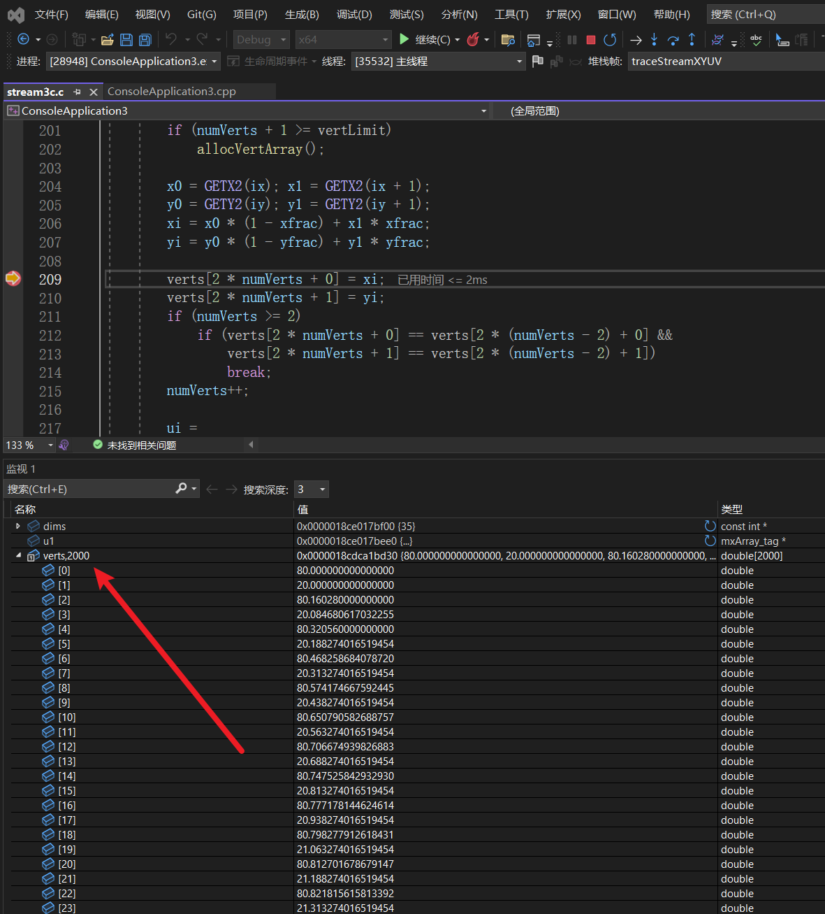

# C语言拾遗

# 1.调试时查看指针数组的值

参见[【visual studio调试】&查看指针数组值_visual studio调试看指针的值-CSDN博客](https://blog.csdn.net/u010608964/article/details/88816867)

调试时，如果某个数组的指针，然后对其进行调试，查看其所有元素的内容，正常情况下是看不到的。可以采取在名字后面加逗号再加数字就可以。数字是多少，就能看到多少个元素

