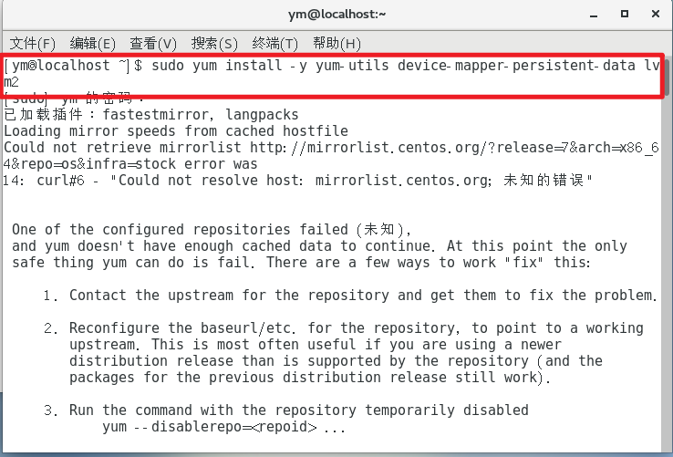
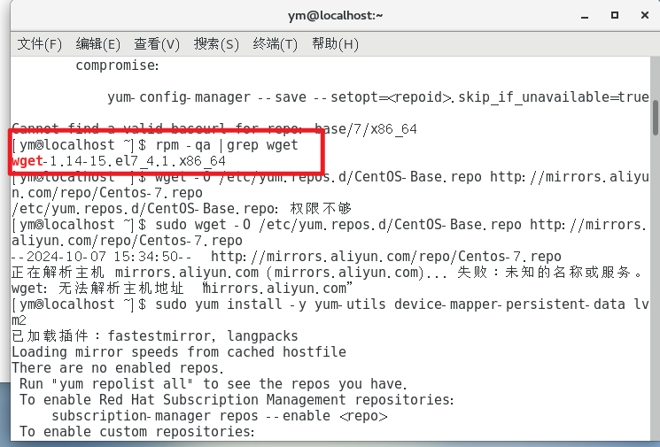
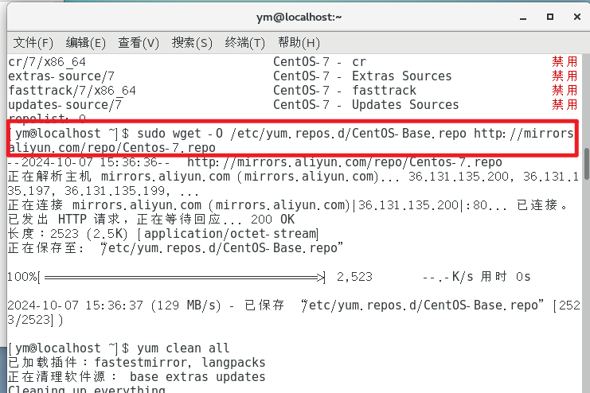
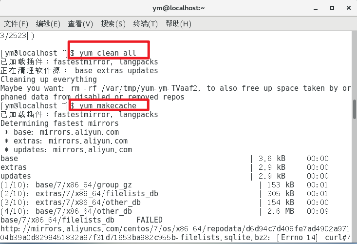
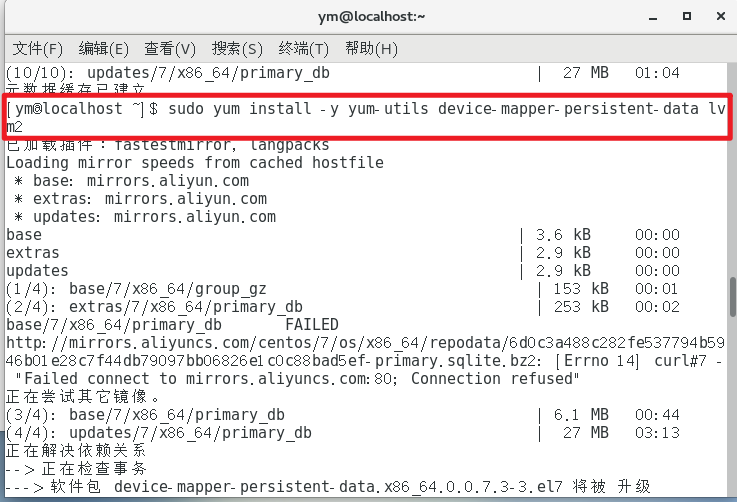

# CentOS安装docker时报错

参照：[Centos7出现问题Cannot find a valid baseurl for repo: base/7/x86_64 - wKingy - 博客园 (cnblogs.com)](https://www.cnblogs.com/Hongxuanred/p/18314277)

在安装docker时，采用下列命令：

```bash
sudo yum install -y yum-utils device-mapper-persistent-data lvm2
```

上述命令作用是：

> 整个命令 `sudo yum install -y yum-utils device-mapper-persistent-data lvm2` 的作用是以root权限自动安装`yum-utils`、`device-mapper-persistent-data`和`lvm2`这三个软件包。
>
> 这些软件包通常用于系统管理和磁盘管理。例如，`lvm2`在创建和管理逻辑卷时非常有用，而`yum-utils`提供了一些额外的工具来增强`yum`的功能。

## 报下列错误：

```
已加载插件：fastestmirror, langpacks
Loading mirror speeds from cached hostfile
Could not retrieve mirrorlist http://mirrorlist.centos.org/?release=7&arch=x86_64&repo=os&infra=stock error was
14: curl#6 - "Could not resolve host: mirrorlist.centos.org; 未知的错误"


 One of the configured repositories failed (未知),
 and yum doesn't have enough cached data to continue. At this point the only
 safe thing yum can do is fail. There are a few ways to work "fix" this:

     1. Contact the upstream for the repository and get them to fix the problem.

     2. Reconfigure the baseurl/etc. for the repository, to point to a working
        upstream. This is most often useful if you are using a newer
        distribution release than is supported by the repository (and the
        packages for the previous distribution release still work).

     3. Run the command with the repository temporarily disabled
            yum --disablerepo=<repoid> ...

     4. Disable the repository permanently, so yum won't use it by default. Yum
        will then just ignore the repository until you permanently enable it
        again or use --enablerepo for temporary usage:

            yum-config-manager --disable <repoid>
        or
            subscription-manager repos --disable=<repoid>

     5. Configure the failing repository to be skipped, if it is unavailable.
        Note that yum will try to contact the repo. when it runs most commands,
        so will have to try and fail each time (and thus. yum will be be much
        slower). If it is a very temporary problem though, this is often a nice
        compromise:

            yum-config-manager --save --setopt=<repoid>.skip_if_unavailable=true

Cannot find a valid baseurl for repo: base/7/x86_64

```



## 根本原因是yum源有问题

## 解决方案为下载国内`yum源配置文件`到`/etc/yum.repos.d/CentOS-Base.repo`

此处使用阿里云CentOS7源

> 阿里云 CentOS 7 源（推荐）：
>
> wget -O /etc/yum.repos.d/CentOS-Base.repo http://mirrors.aliyun.com/repo/Centos-7.repo
>
> 网易163 CentOS 7 源：
>
> wget -O /etc/yum.repos.d/CentOS-Base.repo http://mirrors.163.com/.help/CentOS7-Base-163.repo
>
> 搜狐 CentOS 7 源：
>
> wget -O /etc/yum.repos.d/CentOS-Base.repo http://mirrors.sohu.com/help/CentOS7-Base-sohu.repo
>
> 华为云 CentOS 7 源：
>
> wget -O /etc/yum.repos.d/CentOS-Base.repo http://mirrors.myhuaweicloud.com/repo/CentOS-7.repo
>
> 华东理工大学 CentOS 7 源：
>
> wget -O /etc/yum.repos.d/CentOS-Base.repo https://mirrors.ustc.edu.cn/centos/7/os/x86_64
>
> 清华大学 CentOS 7 源：
>
> wget -O /etc/yum.repos.d/CentOS-Base.repo https://mirrors.tuna.tsinghua.edu.cn/centos/7/os/x86_64/
>
> 北京理工大学 CentOS 7 源：
>
> wget -O /etc/yum.repos.d/CentOS-Base.repo https://mirrors.bfsu.edu.cn/centos/7/os/x86_64/
>
> 上海交通大学 CentOS 7 源：
>
> wget -O /etc/yum.repos.d/CentOS-Base.repo https://ftp.sjtu.edu.cn/centos/7/os/x86_64/
>
> 中国科学技术大学 CentOS 7 源：
>
> wget -O /etc/yum.repos.d/CentOS-Base.repo https://mirrors.ustc.edu.cn/centos/7/os/x86_64/
>
> 兰州大学 CentOS 7 源：
>
> wget -O /etc/yum.repos.d/CentOS-Base.repo https://mirror.lzu.edu.cn/centos/7/os/x86_64/

### 判断是否有 wget 服务

```bash
rpm -qa |grep wget
```



这种结果表示有wget

### 换源链接

```bash
sudo wget -O /etc/yum.repos.d/CentOS-Base.repo http://mirrors.aliyun.com/repo/Centos-7.repo
```



### 清理 yum 缓存，并生成一个新的缓存

```bash
yum clean all
yum makecache
```



## 重新下载即可




