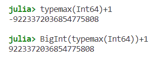
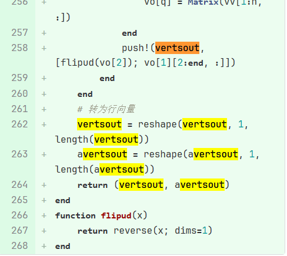

# Julia拾遗

# 1.如何生成一个1到100，间隔为2的数组

```julia
1:2:100
```

### 如何生成一个1到50，共100个元素的数组

```julia
LinRange(1, 50, 100)
```

# 2.如何生成一个垂直于x轴的曲线

```python
y = -10:0.1:10
x = zeros(length(y))
plot(x,y)
```

如果想要在其他位置垂直于x轴，则可以x = zeros(length(y)) + num

# 3.Julia常量修改要注意的内容

声明常量方法

```julia
const a = 1
```

- 常量新赋值不导致原常量值变化的情况下，不会给出任何信息
- 常量新赋值的类型与原常量一致，但是值不一致时，会打印警告，并替换为新的赋值
- 常量新赋值的类型与原常量不一致时，会打印一个错误

# 4.BigInt BigFloat

起到扩位的作用，提供了任意精度的整数和浮点数



# 5.Julia代码耗时统计

使用BenchmarkTools库

具体方法为在包管理模式下，add  BenchmarkTools

然后在使用前julia> using BenchmarkTools

具体使用时：

```julia
@btime mymax(1,2)
```

# 6.代码结构分析 @code_warntype

@code_warntype 会用黄色/红色标记类型不稳定的情况

具体使用：

```julia
@code_warntype mymax(1,2)
MethodInstance for mymax(::Int64, ::Int64)
  from mymax(a, b) @ Main REPL[1]:1
Arguments
  #self#::Core.Const(mymax)
  a::Int64
  b::Int64
Body::Int64
1 ─ %1 = (a > b)::Bool
└──      goto #3 if not %1
2 ─      return a
3 ─      return b
```

# 7.全局变量

global 只是在模块之内有作用，到模块之外就不能被调用

# 8.软作用域

在Julia中，变量的作用域指的是变量可被访问的代码区域。Julia中有三种类型的作用域：全局作用域、硬本地作用域和软本地作用域。

软作用域是Julia中一个特殊的概念，它主要出现在循环（如`for`和`while`）和`try/catch`块中。在这些情况下，如果你在一个代码块中对一个变量进行赋值，Julia会首先检查该变量是否已经在当前的本地作用域中定义过。如果是，那么这个赋值操作会更新本地作用域中的变量。如果不是，那么这个赋值操作会更新全局作用域中的变量（如果存在的话），如果全局作用域中也没有这个变量，那么它会在本地作用域中创建一个新的变量。

这就是所谓的“软作用域”：在循环和`try/catch`块中，一个变量的作用域既可能是本地的，也可能是全局的，这取决于该变量在哪里被首次定义。

然而，这种行为在交互式环境中（如REPL或Jupyter notebook）可能会导致一些混淆。在这些环境中，如果你在一个循环或`try/catch`块中对一个变量进行赋值，而该变量并没有在本地作用域中被定义过，那么Julia会默认在全局作用域中创建一个新的变量，而不是在本地作用域中。这就是所谓的“全局作用域泄漏”。

为了避免这种混淆，Julia推荐尽量在函数中进行计算，因为函数会创建一个硬本地作用域，这意味着在函数中的所有变量都是本地的，不会影响全局作用域。

资料来源：

- [Scope of Variables · The Julia Language](https://docs.julialang.org/en/v1/manual/variables-and-scoping/)
- [Exploring Modules and Variable Scope in Julia Programming](https://www.juliabloggers.com/exploring-modules-and-variable-scope-in-julia-programming/)
- [Julia - Modules, Variable Scope Study](https://blog.glcs.io/modules-variable-scope)
- [Soft local scope · Julia for Optimization and Learning - GitHub Pages](https://juliateachingctu.github.io/Julia-for-Optimization-and-Learning/stable/lecture_03/scope/)
- [Best solution to Julia's soft scope problem?](https://discourse.julialang.org/t/best-solution-to-julias-soft-scope-problem/70199)

# 9.haskey方法   判断kwargs内是否有某个属性

haskey(collection, key) -> Bool

用于确定集合是否具有给定key的映射

例如

```julia
if haskey(kwargs, :zorder)
```

zorder前面的冒号的作用：

在Julia中，冒号`:`通常用作关键字参数的标志。在这种上下文中，`:zorder`表示一个关键字参数名。`haskey(kwargs, :zorder)`用于检查`kwargs`字典中是否存在名为`:zorder`的关键字参数。

# 10.获取数组元素数量

使用length()方法

```julia
test = [1, 2, 3, 4, 5, 6]
println("数组test的元素数量：", length(test))
```

# 11.Julia与C语言获取二维数组某一个位置下的元素

需要注意的是C语言按行优先顺序存储，因此

```c
int a[3][3] = { {1, 2, 3}, {4, 5, 6}, {7, 8, 9} };
```

在内存中，相当于是1,2,3,4,5,6,7,8,9

而Julia语言是按列优先顺序存储，因此

```julia
a = [1 2 3; 4 5 6; 7 8 9]
```

在内存中，相当于是1,4,7,2,5,8,3,6,9

C语言的获取公式为Y+ydim*X。例如a[ 1 ] [ 2 ] = a[2 + 3 * 1] = a[5]=6。此处（X,Y）=(1,2)是二维索引位置，ydim是列数量也就是一行元素数量，因此ydim*X可以知道在第几行，Y知道在该行的第几个。

Julia语言的获取公式为X+xdim*(Y-1)。例如a[ 2 ] [ 3] = a[2 + 3 * (3-1)] = a[8] = 6。此处（X,Y）=(2,3)是二维索引位置，xdim是行数量，也就是一列元素数量，因此xdim*(Y-1)可以知道在第几列，X知道在该列的第几个。

# 12.julia获取工作区变量的方法

```julia
prop_val = getfield(Main, Symbol(变量名))
```

# 13.Julia遍历字典

在Julia中，你可以使用`for`循环和`pairs()`函数来遍历字典。以下是一个例子：

```julia
# Assume dict is the dictionary you want to iterate over
for (key, value) in pairs(dict)
    println("Key: ", key)
    println("Value: ", value)
end
```

这段代码会遍历`dict`中的每一对键值对，并打印出键和值。`pairs()`函数会返回一个可迭代对象，包含`dict`中的每一对键值对。在每次迭代中，`(key, value)`将会是字典中的一对键值对。

# 14.julia创建空字典

在Julia中，你可以使用`Dict()`函数来创建一个空字典。以下是一个例子：

```julia
empty_dict = Dict()
```

这段代码会创建一个新的空字典，并将其赋值给变量`empty_dict`。

如果你想创建一个具有特定键值类型的字典，你可以在`Dict()`函数中指定类型。例如，如果你想创建一个键为字符串类型，值为整数类型的字典，你可以使用以下代码：

```julia
typed_dict = Dict{String, Int}()
```

这段代码会创建一个新的空字典，其键为字符串类型，值为整数类型，并将其赋值给变量`typed_dict`。

# 15.julia如何将一个字符串转为symbol类型

在Julia中，你可以使用`Symbol()`函数将一个字符串转换为符号。以下是一个例子：

```julia
str = "my_string"
sym = Symbol(str)
```

这段代码会将字符串`str`转换为符号，并将结果赋值给变量`sym`。

请注意，符号在Julia中是一种特殊的类型，它们通常用于表示变量名或者作为字典的键。符号是不可变的，且它们的比较非常快，因为Julia会为每个唯一的符号分配一个唯一的内部标识符，所以比较两个符号只需要比较它们的标识符。

# 16.Julia中，!==和!=的区别

在Julia中，`!==`和`!=`都是比较运算符，但它们的含义和作用是不同的。

`!=`是用于检查两个值是否不相等的运算符，它会返回一个布尔值。例如，`5 != 3`会返回`true`。

`!==`则是用于检查两个值是否非同一对象的运算符。它不仅检查两个值是否不相等，还检查它们是否是同一对象。例如，`5 !== 5.0`会返回`true`，因为尽管5和5.0在值上是相等的，但它们并非同一对象。

以下是一些相关的参考资料：

- [What is the difference between "==" and "===" comparison operators in Julia?](https://stackoverflow.com/questions/38601141/what-is-the-difference-between-and-comparison-operators-in-julia)
- [Comparing Julia variable to `nothing` using !== or !=](https://stackoverflow.com/questions/56852880/comparing-julia-variable-to-nothing-using-or)
- [Mathematical Operations and Elementary Functions - Julia](https://docs.julialang.org/en/v1/manual/mathematical-operations/)
- [Operators in Julia - GeeksforGeeks](https://www.geeksforgeeks.org/operators-in-julia/)
- [Julia beginner's corner: mastering comparison operators](https://bkamins.github.io/julialang/2021/10/08/comparisons.html)

# 17.Julia判断数组内是否存在NaN

MATLAB实现该功能的函数为anynan(u)

在Julia中，与MATLAB的`anynan`函数相对应的函数是`any(isnan, x)`，其中`x`是你想要检查是否含有NaN的变量。例如：

```julia
x = [1, NaN, 3]
println(any(isnan, x))  # 输出：true
```

在这个例子中，`any(isnan, x)`函数检查数组`x`是否含有NaN值，如果含有，则返回`true`。

以下是一些相关的参考资料：

- [How do you do the Matlab equivalent of any,all in Julia](https://discourse.julialang.org/t/how-do-you-do-the-matlab-equivilant-of-any-all-in-julia/93289)
- [JuliaInterop/MATLAB.jl: Calling MATLAB in Julia through MATLAB](https://github.com/JuliaInterop/MATLAB.jl)
- [Noteworthy Differences from other Languages - The Julia Language](https://docs.julialang.org/en/v1/manual/noteworthy-differences/)
- [Native Julia noteworthy differences from MATLAB - MatLang](https://docs.juliahub.com/General/MatLang/stable/juliavsmatlab/)

# 18.Julia中min函数和minimum函数的区别

在Julia中，`min`函数和`minimum`函数都用于找出最小值，但它们的使用场景有所不同：

- `min`函数用于比较两个或更多的数值，找出其中的最小值。例如：

```julia
min_val = min(10, 7, 15, 4) # 输出：4
```

- `minimum`函数用于找出数组中的最小值，或者在指定维度上找出最小值。例如：

```julia
arr = [5, 10, 2, 8, 3]
min_val = minimum(arr) # 输出：2
```

以下是一些相关的参考资料：

- [How to get minimal value of Array in Julia? - Stack Overflow](https://stackoverflow.com/questions/36304230/how-to-get-minimal-value-of-array-in-julia)
- [Multi-dimensional Arrays - The Julia Language](https://docs.julialang.org/en/v1.4/manual/arrays/)
- [minimum(A,dims) - Julia Functions](https://www.jlhub.com/julia/manual/en/function/minimum)
- [Getting minimum elements in Julia - GeeksforGeeks](https://www.geeksforgeeks.org/getting-minimum-elements-in-julia-minimum-and-minimum-methods/)
- [min - Julia Functions](https://www.jlhub.com/julia/manual/en/function/min)

# 19.Julia生成1行n列的二维数组，其中每一列都是一个不同大小的二维矩阵

具体描述：在Julia编程语言中创建一个嵌套的二维数组（或者说矩阵），其中每个元素都是一个不同维度的二维矩阵。具体来说，你想要的最终结构是一个一行多列的二维数组，其中每一列都是一个不同大小（例如 521x2，54x2，44x2）的二维矩阵。

```julia
vertsout = []
push!(vertsout, [flipud(vo[2]); vo[1][2:end, :]])#此行代码放在循环等结构中，生成521x2、54x2的矩阵，并放进vertsout数组中
vertsout = reshape(vertsout, 1, length(vertsout))#将vertsout数组由n行1列的结构，转为1行n列的结构
```



