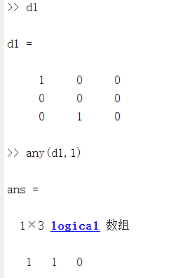
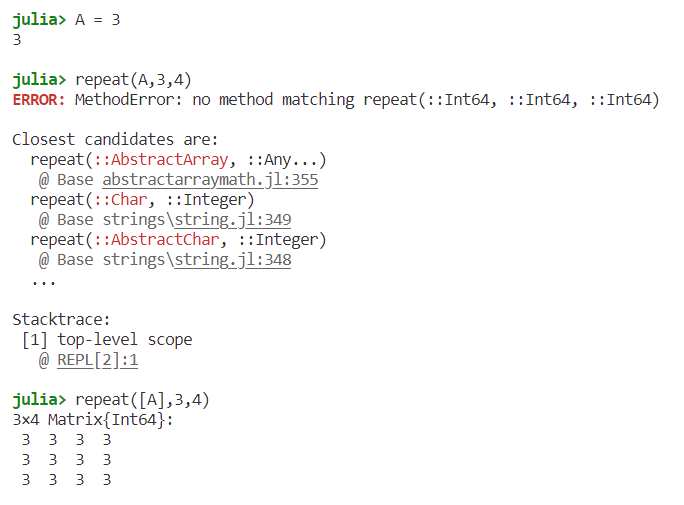

# MATLAB拾遗

# 1.绘制曲线时指定曲线的属性

例如我需要在绘制曲线时，指定曲线的颜色和label，可以采用下列格式

```matlab
line4 = plot(ax2, x2, y2,'DisplayName','cosx-3','color','blue')
```

即"属性名称","属性值"的格式

# 2.指定某个Axes的xlim

可采用xlim(ax,[xlim])的格式，例如我需要指定ax2的xlim为[11,15]

```matlab
xlim(ax2,[11,15])
```

# 3.性能测试

```python
tic
operations
toc
```

# 4.将变量保存为文件

```matlab
data = rand(5000,1)
dlmwrite('data.txt',data)
```

# 5.查看matlab源码

```matlab
open 函数名
```


另外可以用everything搜索函数.m

# 6.randn函数

在MATLAB中，randn(1e6, 1)中的1e6表示要生成的随机数的数量，即生成一个由1百万个随机数组成的列向量。而末尾的1表示列向量的列数为1，即生成的随机数列向量是一个垂直的列向量。

因此，randn(1e6, 1)生成了一个由1百万个符合标准正态分布的随机数组成的列向量。

# 7.any(Matrix,number)用法

用来判断矩阵的行/列中是否存在至少一个非零元素。

示例数据：

```css
d1 = [1 0 0;      
	  0 0 0;     
      0 1 0];
```

## any(matrix,1)表示沿着矩阵的列进行逻辑运算

返回一个行向量，如果该列有非零元素，返回1，如果没有返回0，那么此测例会返回

```
[1 1 0]
```



julia对应实现方式

```julia
any(matrix,dims=1)
```


## any(matrix,2)表示沿着矩阵的行进行逻辑运算

返回一个列向量，表示每一行的结果


对于julia用法的补充：

julia不支持对浮点数的补充，如


解决方法：

```julia
any(d1 .!= 0, dims=2)
```


# 8.diff(Matrix)用法

对应帮助文档：https://ww2.mathworks.cn/help/releases/R2020b/matlab/ref/diff.html?s_tid=doc_ta

diff是求差分的函数，如果参数是p × m矩阵，则Y = diff(Matrix)返回大小为(p-1)×m的矩阵，其元素是x的行之间的差分

示例数据：

```matlab
verts = [1 2 3;         
		4 5 6;         
		7 8 9];
```

得到的结果为

```css
[3 3 3;
 3 3 3]
```


对应的julia实现

如果参数dims=1，则是按照行求差分，与matlab一致。如果dims=2，则是按照列求差分。


# 9.repmat(A,r1,r2)用法，其中A是数值

实现一个r1×r2的矩阵，其中每一个元素都是A


julia实现类似的效果可以使用repeat(A,r1,r2)来实现，但是需注意，julia的repeat函数不支持传入数值，支持矩阵，因此需要对A进行转换




# 10.创建一个从起始值到结束值之间的等间隔的向量

在Matlab中，你可以使用冒号操作符或`linspace`函数来创建从起始值到结束值之间的等间隔的向量。

1. 使用冒号操作符，语法为`start:step:end`。例如，创建从1到10的步长为1的向量：

```matlab
v = 1:1:10;
```

1. 使用`linspace`函数，语法为`linspace(start, end, n)`，其中`n`是向量中元素的数量。例如，创建从1到10的包含10个元素的向量：

```matlab
v = linspace(1, 10, 10);
```

这些示例来自于Matlab的官方文档和其他权威的非中文资源，你可以在以下链接中找到更多信息：

- [Colon operator - Matlab official documentation](https://www.mathworks.com/help/matlab/ref/colon.html)
- [linspace - Matlab official documentation](https://www.mathworks.com/help/matlab/ref/linspace.html)
- [How do I create a regularly-spaced array of values in MATLAB? - StackOverflow](https://stackoverflow.com/questions/1853891/how-do-i-create-a-regularly-spaced-array-of-values-in-matlab)
- [Methods to Create Vectors in MATLAB - Engineering LibreTexts](https://eng.libretexts.org/Courses/Oxnard_College/Matlab_and_Octave_Programming_for_STEM_Applications_(Smith)/04%3A_Vectors/4.02%3A_Methods_to_Create_Vectors_in_MATLAB)
- [MATLAB Lesson 3 - colon operator - UNSW Sites](https://www.maths.unsw.edu.au/sites/default/files/MatlabSelfPaced/lesson3/MatlabLesson3_Colon.html)

# 11.求标准差

```matlab
std(x)
```

x是待求标准差的一组数

# 12.在title、xlabel等位置添加希腊字母

使用\字母名称的方式来实现，例如：


# 13.matlab设置随机数种子


注意：要使每次的随机数都一致，那么就要保证每次都调用相同的随机数。也就是说随机数种子每次都要设置，而不是设置一次即可

