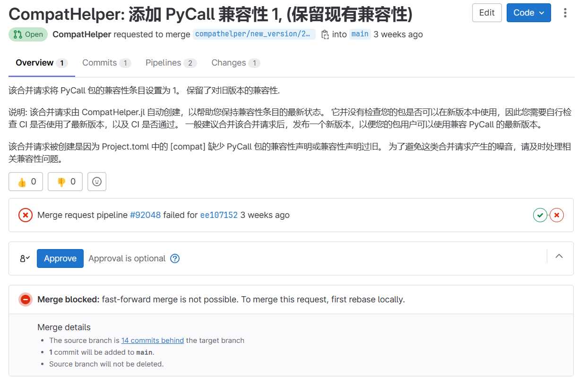
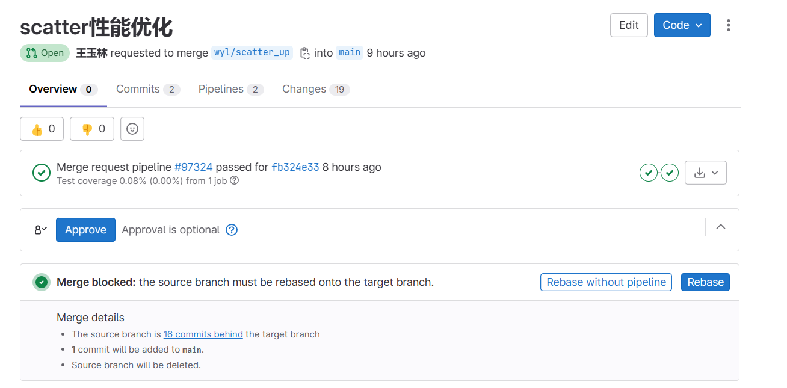
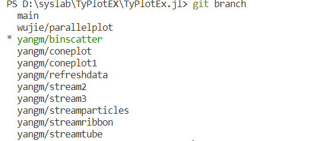
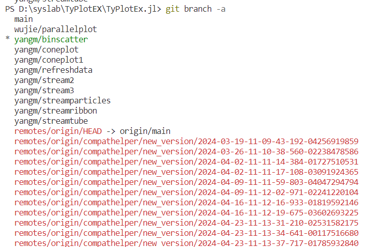
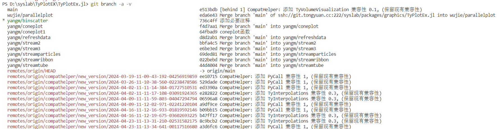

# git拾遗

# 1.两种rebase情境

一种是必须手动rebase，也就是下图这种带三角号的



一种是可以线上rebase，也就是下图这种不带三角号，内部有提示的



# 2.丢弃本地修改的所有文件

有时候需要用命令行方式丢弃本地修改的所有文件

```powershell
git checkout . #本地所有修改的。没有的提交的，都返回到原来的状态
```

[git丢弃本地修改的所有文件（新增、删除、修改）_git本地提交changes新增很多文件-CSDN博客](https://blog.csdn.net/leedaning/article/details/51304690)

# 3.git回退到之前的某个commit

```powershell
git reset --hard 分支名
```

# 4.查看当前所有分支

4.1查看当前本地所有分支

```bash
git branch
```



4.2查看本地和远程的分支

```bash
git branch -a
```



这个过程中，如果要退出，可输入:q来退出

4.3显示分支的最后一次提交

```bash
git branch -a -v
```



# 5.git push时报错：fatal: unable to access ‘xxx.git'

报错信息为

> fatal: unable to access 'https://github.com/ymcfy/knowlege_system.git/': Failed to connect to 127.0.0.1 port 1080 after 2108 ms: Couldn't connect to server

解决方案为：

> 这个错误提示表明 git 试图通过 127.0.0.1（[localhost](https://localhost/)）的 1080 端口连接到 Github，但是连接失败了。这可能是由于以下原因：
>
> 1. 你的网络环境有问题，例如你正在使用的代理服务器没有正常工作。
> 2. 你的 git 配置中设置了错误的代理。
>
> 下面是一些可能的解决方案：
>
> - 检查你的网络环境，确保你可以正常访问 Github。如果你在使用代理服务器，请检查其是否正常工作。
> - 检查你的 git 代理设置。你可以通过在终端输入 `git config --global --get http.proxy` 命令来查看全局代理设置，或者输入 `git config --get http.proxy` 来查看当前仓库的代理设置。如果这些设置中有错误的部分，你可以使用 `git config --global --unset http.proxy` 命令来移除全局代理设置，或者使用 `git config --unset http.proxy` 来移除当前仓库的代理设置。
> - 如果你需要通过代理服务器访问 Github，但是代理服务器的地址或端口设置错误了，你可以通过 `git config --global http.proxy http://proxyserver:port` 命令来设置正确的全局代理，或者通过 `git config http.proxy http://proxyserver:port` 来设置当前仓库的代理。

使用上述的移除全局代理设置方式解决了问题