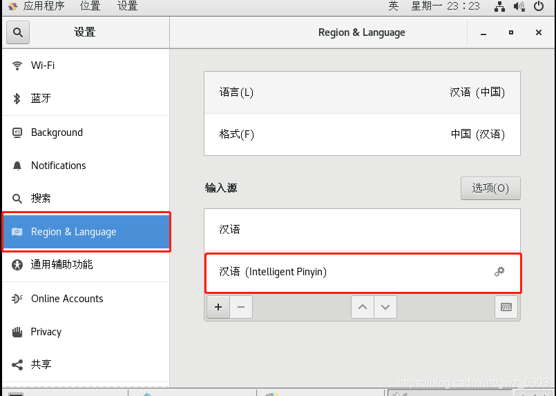
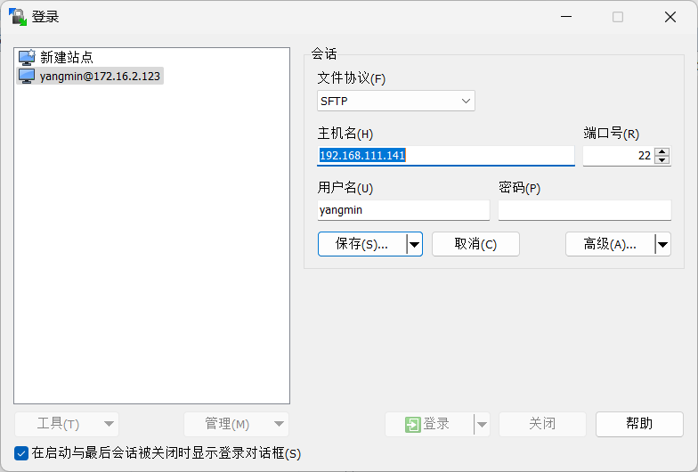
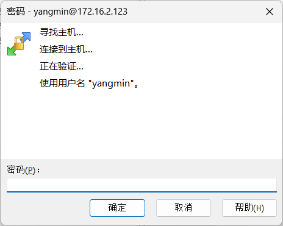
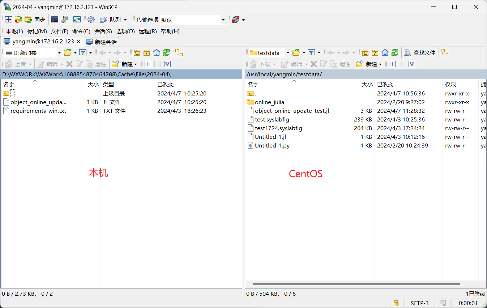
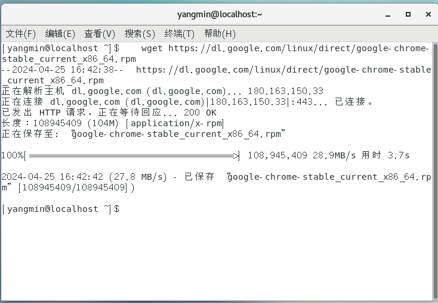
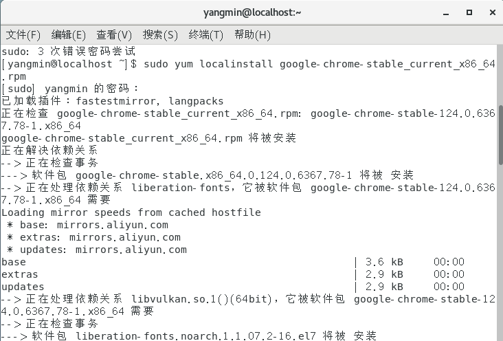
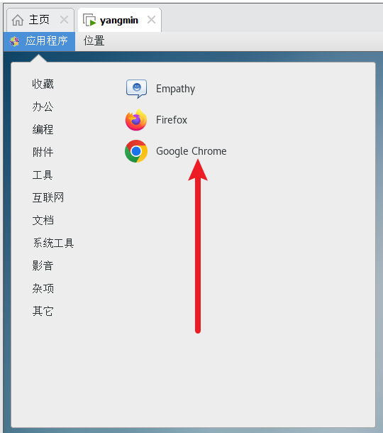

# linux拾遗

# 1.查看ip

使用如下命令：

```powershell
ifconfig
```

# 2.安装中文输入法

- 安装

```powershell
yum install  ibus-libpinyin
```

- 启用



[Centos7安装中文输入法_centos shurufa-CSDN博客](https://blog.csdn.net/gwz_6903/article/details/100679186)

# 3.linux安装git

- git安装

```powershell
sudo yum install git
```

- 配置用户名和邮箱名

```powershell
git config --global user.name "Your Name"
git config --global user.email "email@example.com"
```

- 配置SSH公钥

```powershell
ssh-keygen -C 'example@example.com' -t rsa
```

- 在gitlab仓库配置该公钥

[手把手教你入门Git --- Git使用指南（Linux）_linux 用git-CSDN博客](https://blog.csdn.net/weixin_44966641/article/details/119791118)

[sudo:apt-get:找不到命令，解决方法-CSDN博客](https://blog.csdn.net/m0_73470125/article/details/130613974)

# 4.linux赋予权限

## 4.1为某个文件赋予权限

```powershell
chmod +r file.txt
```

[linux常用命令(7)：chmod命令(给文件赋读写权限/chmod 777)-CSDN博客](https://blog.csdn.net/weixin_49114503/article/details/132994396)

# 5.向虚拟机里的centos传输文件（winscp使用）

使用winscp软件



输入密码



传输



# 6.安装CentOS

[CentOS7(Linux)详细安装教程（图文详解）_centos7安装教程-CSDN博客](https://blog.csdn.net/weixin_43849575/article/details/102996790)

一定要注意安装图形化界面！

# 7.在命令行界面安装图形化界面

在CentOS上安装图形化界面的步骤通常如下：

1. 打开终端。
2. 更新你的系统。你可以使用`yum`命令来做这个，例如：

plaintext

```plaintext
   sudo yum update
```

1. 安装GNOME桌面环境。你可以使用`yum`命令来做这个，例如：

plaintext

```plaintext
   sudo yum groupinstall "GNOME Desktop"
```

或者

plaintext

```plaintext
   sudo yum groups install "Server with GUI"
```

1. 设置GNOME为默认的运行级别，这样你的CentOS在启动时会直接进入图形化界面：

plaintext

```plaintext
   sudo systemctl set-default graphical.target
```

1. 重启你的系统：

plaintext

```plaintext
   sudo reboot
```

你的系统应该会启动到GNOME桌面环境。

资料来源：

- [How to Install GUI on CentOS 7 [Complete Guide\] - Cloudzy](https://cloudzy.com/blog/install-gui-on-centos-7/)
- [How to start/install GUI on RHEL 8 / CentOS 8 Linux - LinuxConfig](https://linuxconfig.org/redhat-8-start-gui)
- [How to install a GUI on top of CentOS 7 | TechRepublic](https://www.techrepublic.com/article/how-to-install-a-gui-on-top-of-centos-7/)
- [How To Install Gui In Centos 7 - JOE TECH](https://tech.joellemena.com/centos/how-to-install-gui-in-centos-7/)
- [How To CentOS / RHEL 7 Install Gnome Desktop Using Yum - nixCraft](https://www.cyberciti.biz/faq/howto-install-gnome-gui-desktop-on-centos-rhel-7-server/)

# 8.linux matplotlib适配中文字体步骤

步骤如下：

> 1.打开Syslab Online
>
> 2.新建一个文件夹，路径为~/font_install。在该文件夹下新建一个名为cachedir.py的Python脚本。在该脚本中运行以下代码
>
> ```python
> import matplotlib as mpl
> print(mpl.get_cachedir())
> ```
>
> 输出matplotlib的缓存路径。
>
> 3.在资源管理器中右键点击cachedir.py脚本，在弹出菜单中选择“在集成终端中打开”，然后在终端中执行以下代码
>
> ```bash
> rm -r matplotlib的缓存路径/*
> ```
>
> 4.在集成终端中，在/usr/share/fonts目录下创建一个名为chinese的文件夹
>
> ```bash
> sudo mkdir /usr/share/fonts/chinese
> ```
>
> 5.在集成终端中，将之前准备好的字体文件（支持格式为.ttf、.ttc）复制或移动到/usr/share/fonts/chinese目录中
>
> ```bash
> sudo cp 字体文件路径 /usr/share/fonts/chinese
> ```
>
> 6.在集成终端中，使用以下命令安装fontconfig
>
> ```bash
> # centos 
> sudo yum install fontconfig -y
> 
> # ubuntu
> sudo apt-get install fontconfig -y
> ```
>
> 7.在集成终端中使用以下命令刷新字体缓存
>
> ```bash
> fc-cache -fv
> ```
>
> 8.在使用中文字体进行测试之前，请注意以下事项：
>
> - 在开始测试之前，请先重启 Syslab Online 。
> - 如果刷新了字体缓存和 重启 Syslab Online 后，仍然没有看到字体生效，请尝试按照以下步骤操作：先清除 matplotlib 缓存（步骤2、3），然后再刷新字体缓存（步骤7），最后再次重启 Syslab Online 。

方法一（需要改配置，不推荐）

https://blog.csdn.net/tglzzz/article/details/114676350

[ubuntu解决matplotlib绘图中文显示问题_unbutu里的matplotlib绘图中文不显示-CSDN博客](https://blog.csdn.net/weixin_45707277/article/details/118631442)

方法二（不需要改配置，推荐）

https://blog.csdn.net/weixin_54227557/article/details/134233802

# 9.linux安装字体文件步骤

参照https://blog.csdn.net/wlwlwlwl015/article/details/51482065

# 10.linux删除某个文件

```bash
rm /path/to/your/file_1.txt
```

## 删除某个文件夹

```bash
rm -rf 目录
```

-r表示递归删除，f表示强制删除，无需询问

# 11.linux解压安装包

```bash
unzip 安装包路径
```

# 12.linux运行.sh文件

```bash
./sh文件名
```

# 13.如何在centos安装浏览器，以谷歌浏览器为例

在CentOS上安装Google Chrome浏览器的步骤通常如下：

1. 打开终端。
2. 下载Google Chrome的安装包。你可以使用`wget`命令来下载，例如：



```plaintext
   wget https://dl.google.com/linux/direct/google-chrome-stable_current_x86_64.rpm
```

3.下载完成后，使用`yum`命令来安装下载的.rpm文件，例如：

```plaintext
   sudo yum localinstall google-chrome-stable_current_x86_64.rpm
```

这个命令会要求你输入用户密码，然后安装Chrome和所有其他需要的包。



4.安装完成后，你可以在终端中输入`google-chrome`来启动Google Chrome，或者在Gnome activities菜单中搜索并启动Google Chrome。



# 14.linux的sudo命令

在普通命令前添加sudo，可以起到以管理员身份调用该命令的作用

# 15.centos处理Warning: Your operating system has run out of inotify capacity.问题

当你在CentOS上遇到“Your operating system has run out of inotify capacity”的警告时，通常是因为inotify的实例或监视器数量已达到系统的限制。inotify是Linux内核的一个子系统，它用于监视文件系统的更改。

你可以通过在终端中输入以下命令来查看当前的限制：

```plaintext
cat /proc/sys/fs/inotify/max_user_watches
cat /proc/sys/fs/inotify/max_user_instances
```

如果你需要增加这些限制，可以执行以下命令：

```plaintext
echo fs.inotify.max_user_watches=524288 | sudo tee -a /etc/sysctl.conf && sudo sysctl -p 
echo fs.inotify.max_user_instances=524288 | sudo tee -a /etc/sysctl.conf && sudo sysctl -p
```

这些命令会将最大的inotify实例和监视器数量设置为524288，并将这些设置永久保存在系统配置文件`/etc/sysctl.conf`中。

请注意，这可能需要root权限。在执行这些命令后，你需要重启你的应用或服务以使更改生效。

资料来源：

- [inotify and Solving the “upper limit on inotify watches ... - Baeldung](https://www.baeldung.com/linux/inotify-upper-limit-reached)
- [Inotify Instances Limit (Linux) – IDEs Support (IntelliJ Platform)](https://intellij-support.jetbrains.com/hc/en-us/articles/15268110231826-Inotify-Instances-Limit-Linux)
- [Error "User limit of inotify watches reached". ExtReact build - Stack Overflow](https://stackoverflow.com/questions/47075661/error-user-limit-of-inotify-watches-reached-extreact-build)
- [Need to increase /proc/sys/fs/inotify/max_user_instances #3991 - GitHub](https://github.com/jellyfin/jellyfin/issues/3991)
- [.net - user limit (128) on the number of inotify instances has been ... - Stack Overflow](https://stackoverflow.com/questions/72576431/user-limit-128-on-the-number-of-inotify-instances-has-been-reached)