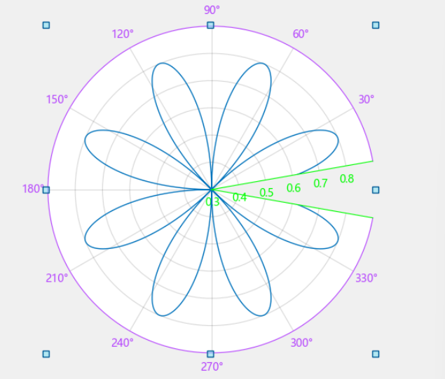
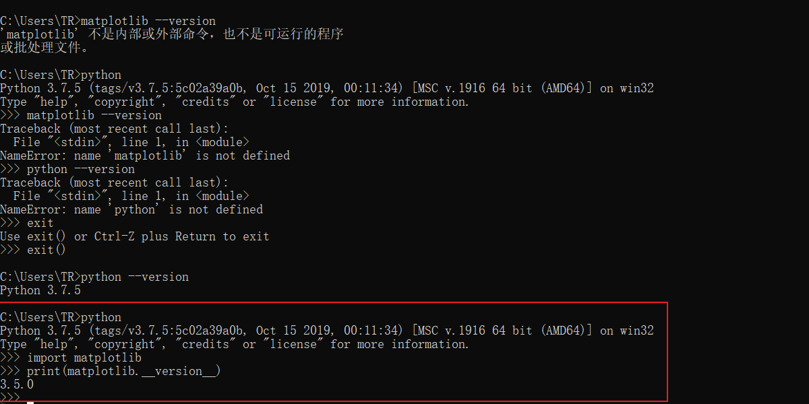
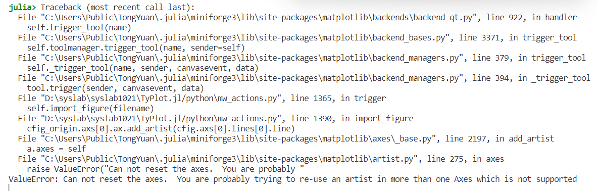
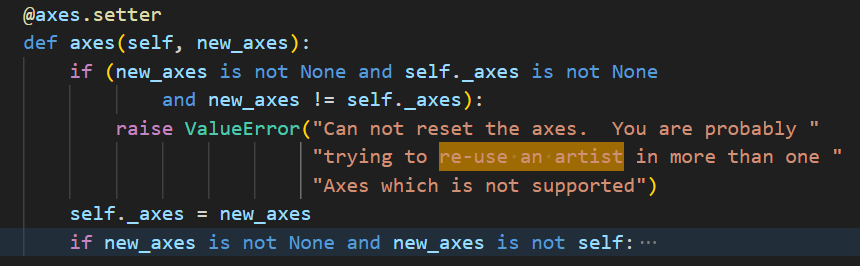
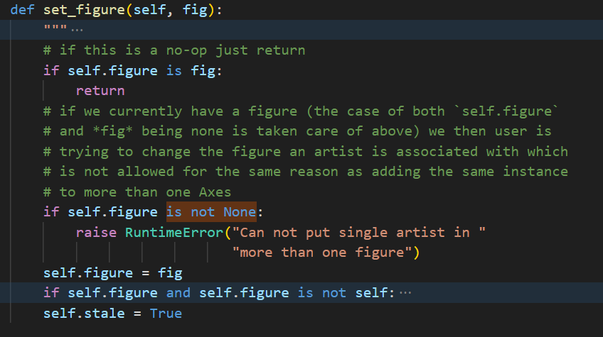
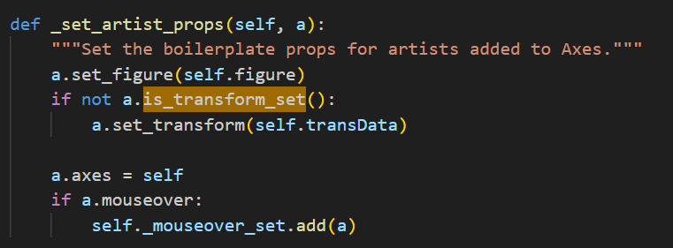
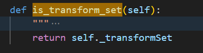
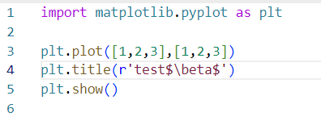
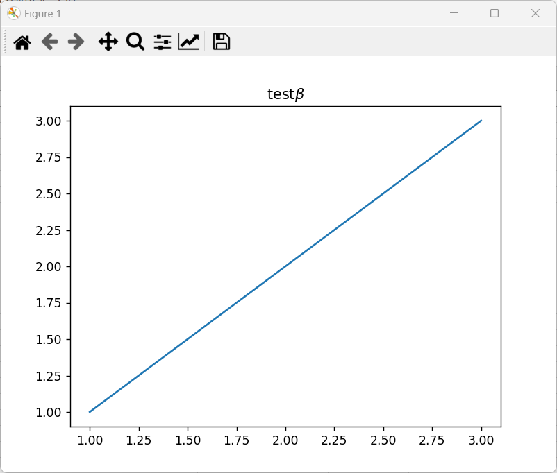

# matplotlib拾遗

# 1.relim()函数

更新Axes范围，适应Axes内曲线或其他元素的坐标轴范围

```python
axes.relim()
```

# 2.autoscale()函数

自动调整坐标轴范围

```python
axes.autoscale()
```

# 3.draw_idle()函数

局部刷新

```python
figure.canvas.draw_idle()
```

# 4.槽函数（鼠标点击事件等）

```python
def connect(self):
    self.cid_key_press = self.ax.figure.canvas.mpl_connect(
         'key_press_event', self.on_key_press)
    # self.cidpress = self.line.figure.canvas.mpl_connect(
    #     'button_press_event', self.on_press)
    
def on_key_press(self, event):
    if event.key == 'ctrl+c':
        self.line_copy()
        return
        
def disconnect(self):
    self.fig.canvas.mpl_disconnect(self.cid_key_press)
```

[matplotlib事件处理基础（事件绑定、事件属性）_canvas.mpl_connect-CSDN博客](https://blog.csdn.net/mighty13/article/details/112448813?ops_request_misc=%7B%22request%5Fid%22%3A%22169085970016800197083464%22%2C%22scm%22%3A%2220140713.130102334.pc%5Fall.%22%7D&request_id=169085970016800197083464&biz_id=0&utm_medium=distribute.pc_search_result.none-task-blog-2~all~first_rank_ecpm_v1~rank_v31_ecpm-2-112448813-null-null.142^v91^control_2,239^v12^control&utm_term=matplotlib绑定点击事件&spm=1018.2226.3001.4187)

# 5.spines 图脊

笛卡尔坐标系的图脊与极坐标系的图脊是不同的，可以采用self.ax.spines._dict方法来获取图脊类型

笛卡尔坐标系：left、right、bottom、top

```python
{'left': <matplotlib.spines.Spine object at 0x000001AC5E3E11C8>, 'right': <matplotlib.spines.Spine object at 0x000001AC5E50BCC8>, 'bottom': <matplotlib.spines.Spine object at 0x000001AC5E50F048>, 'top': <matplotlib.spines.Spine object at 0x000001AC5E5FA3C8>}
```

极坐标系：polar、start、end、inner

```python
{'polar': <matplotlib.spines.Spine object at 0x000001AC5AF1D208>, 'start': <matplotlib.spines.Spine object at 0x000001AC5AF1D908>, 'end': <matplotlib.spines.Spine object at 0x000001AC5AF1DC88>, 'inner': <matplotlib.spines.Spine object at 0x000001AC5AF1DF88>}
```

下图中绿色线条为start、end、inner，紫色线条为polar



# 6.查看当前版本

查看当前matplotlib版本的方法为：



# 7.绘制三维曲线

```python
import matplotlib.pyplot as plt
import numpy as np

plt.subplot(1,1,1,projection="3d")#重点
x = np.linspace(0, 10, 100)
y = np.cos(x)
z = np.sin(x)

line1 = plt.plot(x,y,z)
plt.show()

```

# 8.关闭图窗

关闭图窗可以使用plt.close()函数

# 9.开启交互与关闭交互

matplotlib开启交互的方法

```python
plt.ion()
```

matplotlib关闭交互的方法

```python
plt.ioff()
```

- `plt.ion()`（interactive on）将 Matplotlib 设置为交互模式，使得在每次绘图后无需重新启动内核或窗口就能够立即显示绘图。
- `plt.ioff()`（interactive off）则是关闭交互模式，绘图不会自动显示，需要使用 `plt.show()` 显示图形。

# 10.将一个曲线直接添加到另一个坐标轴中

目前需要实现一个关键代码Demo，一个sinx，一个直线，然后实现追加导入。这里面目前可知的难点在于，如何将一个曲线，放到另一个坐标轴中，之前遇到过类似的问题，一个artist是不能在另一个axes里面复用的。采用了以下两种方式，均不能实现将一个曲线直接添加到另一个坐标轴中：

```python
cfig_origin.axs[0].ax.add_line(cfig.axs[0].lines[0].line)
cfig_origin.axs[0].ax.add_artist(cfig.axs[0].lines[0].line)
```

这两种方法均会报下列错误：



在[关于python：在matplotlib中的单独图中绘制子图轴 | 码农家园 (codenong.com)](https://www.codenong.com/44780452/)里提到了类似问题，没有提到原因，但是提到可以采用提取数据进行绘制的方式解决类似问题。

在官方文档[Artist tutorial — Matplotlib 3.8.2 documentation](https://matplotlib.org/stable/tutorials/artists.html#axes-container)里有以下介绍，解释了为什么不能够直接将artist加到Axes里：

> You should not add objects directly to the or lists, because the needs to do a few things when it creates and adds an object:`Axes.lines``Axes.patches``Axes`
>
> - It sets the and property of the `figure``axes``Artist`;
> - It sets the default transformation (unless one is already set);`Axes`
> - It inspects the data contained in the to update the data structures controlling auto-scaling, so that the view limits can be adjusted to contain the plotted data.`Artist`
>
> You can, nonetheless, create objects yourself and add them directly to the using helper methods like [`add_line`](https://matplotlib.org/stable/api/_as_gen/matplotlib.axes.Axes.add_line.html#matplotlib.axes.Axes.add_line) and [`add_patch`](https://matplotlib.org/stable/api/_as_gen/matplotlib.axes.Axes.add_patch.html#matplotlib.axes.Axes.add_patch).
>
> 翻译：
>
> 这个段落讲述了不应该直接向`Axes.lines`或`Axes.patches`列表中添加对象，因为在创建和添加对象时，Axes需要执行几项操作：
>
> 1. 它设置了`figure`, `axes` 和 `Artist` 的属性。
> 2. 它设置默认的转换（除非已经设置了一个）。
> 3. 它检查包含在对象中的数据，以更新控制自动缩放的数据结构，以便调整视图限制以包含绘制的数据。
>
> 然而，你仍然可以自己创建对象，并使用`add_line`和`add_patch`等辅助方法直接将其添加到`Axes`中。

推断add_line方法不起作用的原因是添加的line中包含ax属性和fig属性，源码对这两个属性进行判断，发现如果这两个属性不为None，那么就抛出错误：can not re-use an artist in more than an axes。





那么从这个思路出发，可以将line中的ax属性和fig属性设置为None。

```python
c_line.line.__dict__['_axes'] = None
c_line.line.__dict__['figure'] = None
```

在设置为None之后，发现可以顺利添加，但是发现，添加进来的曲线无限长，那么说明其转换坐标系出现问题，那么就需要再考虑对转换坐标系做处理。在设置transform前有一个判断，is_transform_set，其本质是判断_transformSet属性。因此需要再对_transformSet属性做处理





```python
c_line.line.__dict__['_axes'] = None
c_line.line.__dict__['figure'] = None
c_line.line.__dict__['_transformSet'] = False
cfig_origin.axs[i].ax.add_line(c_line.line)
```

# 11.figure的fignum规律

`fignum` 是 Matplotlib 中用于表示图形编号的属性。每个 `Figure` 对象都有一个唯一的 `fignum` 属性，代表它所属的图形的编号。这个编号是整数值，并且在创建 `Figure` 对象时由 Matplotlib 自动分配。

规律如下：

- 当你创建第一个 `Figure` 对象时，其 `fignum` 为 1。
- 每创建一个新的 `Figure` 对象，其 `fignum` 值依次递增。

这个规律的主要目的是在多个图形窗口被创建时，能够区分它们并对其进行管理。这样做也有助于用户控制特定的图形对象或窗口。

同时如果通过plt.figure(num)的方法手动赋值fignum的话，之后的fignum会在num的基础上进行递增

# 12.判断坐标轴类型是否一致

```python
if type(cfig_current.axs[i].ax.xaxis) != type(cfig.axs[i].ax.xaxis):
```

# 13.从已知的pathcollection中获取x、y、z轴数据

使用get_offset()方法

# 14.agg.path.chunksize设置

如果正在使用agg后端，那么就可以设置plt.rcParams['agg.path.chunksize']来实现性能提升。这个设置允许用户指定一个块大小，任何具有超过该数量顶点的线将被分成多条线，每条线的顶点数不超过agg.path.chunksize，从而可以提高渲染效率。matplotlib默认是0，也就是不会分块渲染，syslab在mw_main.py里设置为10000

# 15.在matplotlib中展示希腊字母

字符串前面加一个r，然后用$包含希腊字母，例如





# 16.matplotlib隐藏图窗的方法

```python
gcf().canvas.manager.window.setVisible(True)
```

# 17.matplotlib查看支持的所有cmap

在matplotlib中，你可以通过以下方法获取所有内置的colormap（cmap）：

```python
import matplotlib.pyplot as plt

print(plt.colormaps())
```

这段代码会打印出所有matplotlib内置的cmap的名称。在matplotlib中，cmap是用来定义图像或图形色彩的一个重要工具。

你也可以查看官方文档中的[colormap reference](https://matplotlib.org/stable/gallery/color/colormap_reference.html)以了解更多关于matplotlib自带的colormap的信息。

资料来源：

1. [Choosing Colormaps in Matplotlib — Matplotlib 3.8.4 documentation](https://matplotlib.org/stable/users/explain/colors/colormaps.html)
2. [How to view all colormaps available in matplotlib?](https://stackoverflow.com/questions/34314356/how-to-view-all-colormaps-available-in-matplotlib)
3. [Cmap in Python: Tutorials & Examples | Colormaps in Matplotlib](https://www.analyticsvidhya.com/blog/2020/09/colormaps-matplotlib/)
4. [Colormap reference — Matplotlib 3.8.4 documentation](https://matplotlib.org/stable/gallery/color/colormap_reference.html)

# 18.matplotlib根据FigureManagerQT，获取对应的figure的方法

在Matplotlib中，如果你想从`FigureManagerQT`获取对应的`figure`对象，你可以通过`FigureManager`的`canvas.figure`属性来获取。`FigureManager`是一个容器，它包含了实际的后端窗口，这个窗口在屏幕上显示`figure`。`canvas`就是这个后端窗口，而`canvas.figure`就是在这个窗口上显示的`figure`对象。

以下是一个简单的代码示例：

```python
import matplotlib.pyplot as plt

# 创建一个新的figure
fig = plt.figure()

# 获取当前的figure manager
manager = plt.get_current_fig_manager()

# 从figure manager获取figure
fig_from_manager = manager.canvas.figure

# 检查这两个figure是否是同一个
print(fig is fig_from_manager)  # 应该打印True
```

这段代码首先创建了一个新的`figure`，然后获取了当前的`figure manager`。然后，它从`figure manager`中获取了`figure`，并检查了这个`figure`是否与最初创建的`figure`是同一个对象。

# 19.matplotlib只计算非隐藏的曲线，并进行坐标轴范围自动缩放

重点是采用ax.relim(visible_only=True)这行代码，里面visible_only参数的传递

```python
import matplotlib.pyplot as plt
import numpy as np

# 创建数据
x = np.linspace(0, 2 * np.pi, 100)
y1 = np.sin(x) + 3
y2 = np.cos(x)

# 绘制两条曲线
line1, = plt.plot(x, y1, label='sin(x)') 
line2, = plt.plot(x, y2, label='cos(x)')

# 获取当前的axes
ax = plt.gca()

# 隐藏第一条曲线
line1.set_visible(False)

# 重新计算可见的曲线的数据范围，并自动调整坐标轴范围
ax.relim(visible_only=True)
ax.autoscale_view()

# 显示图像
plt.show()

```

