# python基础拾遗

# 1.python之禅

在命令行通过import this可以看到python之禅

The Zen of Python, by Tim Peters

Beautiful is better than ugly.

Python程序员笃信代码可以编写得漂亮而优雅。编程是要解决问题的，设计良好、高效而漂
亮的解决方案都会让程序员心生敬意。随着你对Python的认识越来越深入，并使用它来编写越来
越多的代码，有一天也许会有人站在你后面惊呼：“哇，代码编写得真是漂亮！”

Explicit is better than implicit.

Simple is better than complex.

如果有两个解决方案，一个简单，一个复杂，但都行之有效，就选择简单的解决方案吧。这
样，你编写的代码将更容易维护，你或他人以后改进这些代码时也会更容易。

Complex is better than complicated.

现实是复杂的，有时候可能没有简单的解决方案。在这种情况下，就选择最简单可行的解决
方案吧。

Flat is better than nested.
Sparse is better than dense.
Readability counts.

即便是复杂的代码，也要让它易于理解。开发的项目涉及复杂代码时，一定要为这些代码编
写有益的注释。

Special cases aren't special enough to break the rules.
Although practicality beats purity.
Errors should never pass silently.
Unless explicitly silenced.
In the face of ambiguity, refuse the temptation to guess.
There should be one-- and preferably only one --obvious way to do it.

如果让两名Python程序员去解决同一个问题，他们提供的解决方案应大致相同。这并不是说
编程没有创意空间，而是恰恰相反！然而，大部分编程工作都是使用常见解决方案来解决简单的
小问题，但这些小问题都包含在更庞大、更有创意空间的项目中。在你的程序中，各种具体细节
对其他Python程序员来说都应易于理解。

Although that way may not be obvious at first unless you're Dutch.
Now is better than never.

你可以将余生都用来学习Python和编程的纷繁难懂之处，但这样你什么项目都完不成。不要
企图编写完美无缺的代码；先编写行之有效的代码，再决定是对其做进一步改进，还是转而去编
写新代码。

Although never is often better than *right* now.
If the implementation is hard to explain, it's a bad idea.
If the implementation is easy to explain, it may be a good idea.
Namespaces are one honking great idea -- let's do more of those!

```
美胜于丑
显式胜于隐式
简单胜于复杂
复杂胜于混乱
平铺胜于嵌套
稀疏胜于密集
可读性至关重要
特例不足以打破规则
实用性胜于纯净性
错误不应该默默传递
除非明确压制
面对模棱两可，拒绝猜测
应该有一种——最好只有一种——明显的方法来做
虽然这种方式可能一开始并不明显，除非你是荷兰人
现在总比永远好
虽然永远往往比现在立刻好
如果实现难以解释，那是个坏主意
如果实现容易解释，那可能是个好主意
```

# 2.turtle库

turtle库可用来绘制图形图案，比较典型的函数如goto() speed()等

# 3.print函数

print函数中有一个seq参数，作用是作为两个拼接字符串间的分隔符

```python
print('hello','world',sep='|',end='!\n')
```

结果：

> hello|world!

# 4.range()类

range类可以获取一系列的数，例如

```python
for i in range(3,50,6):
    print(i)
```

结果：

> 3
> 9
> 15
> 21
> 27
> 33
> 39
> 45

此代码中3为起始值，50为终止值，6为步长。前闭后开，即左边界可取到，右边界无法取到

这个类的常见用法为：

```python
@final
class range(Sequence[int]):
    @property
    def start(self) -> int: ...
    @property
    def stop(self) -> int: ...
    @property
    def step(self) -> int: ...
    @overload
    def __init__(self, __stop: SupportsIndex) -> None: ...
    @overload
    def __init__(self, __start: SupportsIndex, __stop: SupportsIndex, __step: SupportsIndex = ...) -> None: ...
    def count(self, __value: int) -> int: ...
    def index(self, __value: int) -> int: ...  # type: ignore[override]
    def __len__(self) -> int: ...
    def __eq__(self, __value: object) -> bool: ...
    def __hash__(self) -> int: ...
    def __contains__(self, __key: object) -> bool: ...
    def __iter__(self) -> Iterator[int]: ...
    @overload
    def __getitem__(self, __key: SupportsIndex) -> int: ...
    @overload
    def __getitem__(self, __key: slice) -> range: ...
    def __reversed__(self) -> Iterator[int]: ...
```

- range一定要注意，是左闭右开的，例如range(3,5)，结果为3，4
- range默认从0开始，例如range(5)，结果为0 1 2 3 4 

# 5.if __ name __ =  '__ main __'用法

接下来的代码只能在本模块中使用，因为只有在本模块的名字才是__ main __

# 6.cv2库   OpenCV库

python的一个计算机视觉库

## 6.1安装方法：

使用清华镜像会快很多

```bash
pip install -i https://pypi.tuna.tsinghua.edu.cn/simple opencv-python
```

## 6.2与turtle结合的脑洞

与turtle结合，读取图片然后绘制出来

代码：

```python
import turtle as t
import cv2

t.getscreen().colormode(255)
img1 = cv2.imread("""practice_day\day0909\ping.jpg""")[0: -2: 2]
img1 = cv2.imread("practice_day\da\
                  y0909\ping.jpg")[0: -2: 2]
width = len(img1[0])
height = len(img1)
t.setup(width=width / 2 + 100, height=height + 100)
t.pu()
t.goto(-width / 4 + 10, height / 2 - 10)
t.pd()
t.tracer(2000)
for k1, i in enumerate(img1):
    for j in i[::2]:
        t.pencolor((j[0], j[1], j[2]))
        t.fd(1)
    t.pu()
    t.goto(-width / 4 + 10, height / 2 - 10 - k1 - 1)
    t.pd()
t.done()
t.mainloop()


```

# 7.字符串

## 7.1字符串换行的方法

- 在换行处用斜杠结尾。此方法也可用于非字符串的代码换行

```python
def F_to_C(F):
   return \
   (F-32)/1.8
```

- 将字符串用三个引号包裹

## 7.2chr()方法

将数字转为对应字符

```python
print(chr(98))
```

结果：

> b

## 7.3ord()方法

将字符转为对应数字

```python
print(ord('a'))
```

结果：

> 97

## 7.4len()

求字符串元素数量

## 7.5title()

将每一个单词首字母大写

```python
print("nigle walter".title())
```

结果：

> Nigle Walter

注意空格的使用

## 7.6upper() lower() isupper() islower()

 将所有单词大写或者小写  判断当前是不是全都大写或者全都小写

## 7.7startswith() endswith()

判断字符串是否以参数开头或者结尾

## 7.8转义字符

如果不想让\起到转义字符串的作用，可以在字符串最前面加上字母r

```python
print("测\t试")
print(r"测\t试")
```

## 7.9 find(str)函数

查找子串所在位置,查找不到返回-1

## 7.10 isdigit()函数

判断字符串是否由数字组成

## 7.11 isalnum()

判断字符串是否由数字和字母组成

## 7.12 strip()

去除字符串左右两侧空格

## 7.13格式化输出字符串

```python
a = 10
b = 30.2
print(f"{a}*{b}={a*b}")
```

结果：

> 10*30.2=302.0

## 7.14字符串不可修改

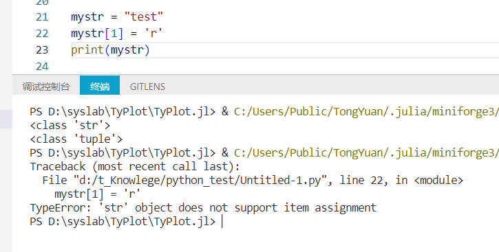

## 7.15查找字符串某段字符的起始位置

index

# 8.命名要求

## 8.1PEP8对受保护的实例属性和私有实例属性的命名要求

> - 用小写字母拼写，多个单词用下划线连接。
> - 受保护的实例属性用单个下划线开头。
> - 私有的实例属性用两个下划线开头。

# 9.运算符

## 9.1 **用法

两个*的意思是求指数

```python
print(3**4)
```

结果：

> 81

## 9.2除法

除法是使用两个斜杠 //

```python
def is_primenumber(num):
    # 素数不能为1
    if num == 1:
        return False
    for i in range(2,num//2):#注意此处的除法
        if num%i==0:
            return False
    return True

print(is_primenumber(3))
```

# 10.函数

## 10.1可变参数

在参数名前面的*表示其是一个可变参数，可变参数args的类型为tuple

```python
def add(*args):
    total = 0
    for val in args:
        total += val
    return total

print(add(3,6,9,2))
```

# 11.作用域

## 11.1作用域关系

python查找变量是，会按照“局部作用域”、“嵌套作用域”、“全局作用域”和“内置作用域”的顺序来查找。因此如果一个局部作用域与全局作用域同名，会优先使用局部作用域。内置作用域是指python内置的标识符，例如print int等

## 11.2global关键字

可以指示某个变量来自全局作用域。例如下面的例子：

```python
num = 200
print(num)
def fun():
    global num # 不加global关键字的话，num不会被修改
    num = 500
    print(num)
fun()
print(num)
```

## 11.3nolocal关键字

可以指示某个变量来自嵌套作用域

## 11.4全局变量

全局变量要减少使用，因为1.作用域和影响过于广泛，可能会发生意料之外的修改和使用。2.生命周期更长，导致长时间无法被垃圾回收。3.降低代码之间的耦合度。

## 11.5闭包

## 11.6for循环中的临时变量的作用域

在for循环外是可以获得for循环最后一次循环的临时变量的值的，但是不建议这样做，如果必须获得，可以在for循环之前定义该变量

# 12.列表list

## 12.1求列表元素数量

len()

## 12.2遍历列表

三种方式

### 用下标遍历

```python
list1 = ['1',2,3.1]
for index in range(len(list1)):
    print(list1[index])
```

### 用元素遍历

```python
for item in list1:
    print(item)
```

### 同时根据下标和元素遍历

```python
for index,item in enumerate(list1):
    print(f"{index}:{item}")
```

## 12.3 删除指定位置元素

pop(index)

## 注意：删除列表内的字典

删除列表内的字典时，如果用下列方式：

```python
nums = [{"a":2},{"a":4},{"a":6},{"a":8}]
for i in nums:
    if i["a"] % 2 == 0:
        nums.remove(i)
print(nums)
```

得到的结果是

> [{'a': 4}, {'a': 8}]

很明显结果不正确

**应该采取下列方式：**

```python
nums = [{"a":2},{"a":4},{"a":6},{"a":8}]
# 使用切片复制列表，以便在循环中删除元素时不会改变迭代对象
for i in nums[:]:
    if i["a"] % 2 == 0:
        nums.remove(i)
print(nums)
```


## 12.4切片

### 反向切片

```python
print(f"反向切片：{list1[::-1]}")
```

结果：

> 反向切片：[3.1, 2, '1']

## 12.5 sorted与sort

sorted不会修改原始列表，sort会修改原始列表

```python
list1 = ['orange', 'apple', 'zoo', 'internationalization', 'blueberry']
list2 = sorted(list1)
print(list1)#['orange', 'apple', 'zoo', 'internationalization', 'blueberry']
print(list2)#['apple', 'blueberry', 'internationalization', 'orange', 'zoo']
list1.sort()
print(list1)#['apple', 'blueberry', 'internationalization', 'orange', 'zoo']
```

## 12.6生成式语法与生成器

```python
# 生成式语法
f = [x for x in range(1,10)]
print(f)
print(sys.getsizeof(f))#占用内存更多，因为元素以及准备就绪
# 生成器
f = (x for x in range(1,10))
print(f)
print(sys.getsizeof(f))#占用内存较少  基本固定在64
for item in  f:
    print(item)
```

下面这个例子较难：

```python
# 生成式语法
f = [x + y for x in 'ABCDE' for y in '1234567']
print(f)
print(sys.getsizeof(f))
# 生成器
f = (x + y for x in 'ABCDE' for y in '1234567')
print(f)
print(sys.getsizeof(f))
for item in  f:
    print(item)
```

## 12.7拼接

下面这两行代码在内存方面有所区别：

```python
self.ax._children[:] = self.ax._children[0:start_index] + self.ax._children[end_index+1:len(self.ax._children)]
self.ax._children = self.ax._children[0:start_index] + self.ax._children[end_index+1:len(self.ax._children)]
```

通过打印输出id(self.ax._children)可知，第一行代码是单纯的切片操作，不会生成新的数组。而第二行则是数组拼接，生成了新的数组。

这两行代码在内存层面有一些区别：

```python
self.ax._children[:] = self.ax._children[0:start_index] + self.ax._children[end_index+1:len(self.ax._children)]
```

这一行代码使用了切片操作符 [:]，它表示对原始的 self.ax._children 进行切片操作，将切片结果直接赋值给原始数组，就地修改了原始数组。这样做的好处是原地修改，不会创建新的数组对象，但是可能会导致一些潜在的问题，因为它直接修改了原始数组。

```python
self.ax._children = self.ax._children[0:start_index] + self.ax._children[end_index+1:len(self.ax._children)]
```

这一行代码直接将切片操作的结果赋值给了 self.ax._children，这样会创建一个新的数组对象，并将原始数组的引用指向新创建的数组。原始数组本身并没有被修改，而是重新指向了新的数组对象。

在内存层面，第一行代码直接修改了原始数组，而第二行代码创建了一个新的数组对象并改变了引用。具体使用哪种方式取决于你的需求，如果需要就地修改，可以选择第一种方式，但要注意可能带来的副作用。如果需要保留原始数组，可以选择第二种方式。

## 12.8在python数组中，交换两部分元素，这两部分元素的数量可能不一致

此处的交换的前提是，已知两部分元素的首尾索引。此处的难点在于，如果先把靠前元素给修改，则靠后的元素的索引就会发生变化，导致后续操作不准确。因此可以考虑先处理靠后元素，则靠前元素的索引就不会有变化。参考代码如下：

```python
def swap_cobjs(self, start1, end1, start2, end2):
    """
    在children数组里更换当前对象与目标对象的位置
    """
    children = self.ax._children

    if end2 < end1:
        start1,end1,start2,end2 = start2,end2, start1,end1

    children[start2:end2+1],children[start1:end1+1] = children[start1:end1+1],children[start2:end2+1]
```

## 12.9判断列表是否为空

1）根据len()判断

```python
list = []
if len(list) == 0:
    print('list is empty')
```

2）直接使用if判断   直接使用`list`作为判断标准，则空列表相当于`False`

```python
list = []
if not list:
    print('list is empty')
```

3）使用`==`进行判断

```python
EmptyList = []
list = []
if list==EmptyList:
    print('list is empty')
```

**注意**: Python中与Java不同。Java中`==`用于判断两个变量是否指向同一个对象，即地址是否相同。但是`Python`中不是，`Python`中，`==`用于判断两个变量的值相等。

## 12.10获取元素在列表内的下 标索引

list.index(元素)

如果元素有多个，返回第一个索引

```python
mylist = ['m','a','b','c','a']
print(mylist.index('a'))
```


## 12.11在列表内指定位置插入指定元素

list.insert(index,元素)

```python
mylist = ['m','a','b','c','a']
# print(mylist.index('a'))
mylist.insert(2,'n')
print(mylist)
```

## 12.12追加元素

### 追加单个元素

mylist.append(元素)

### 追加一批元素

mylist.extend(其他数据容器)

## 12.13统计某一个元素在列表中的数量

mylist.count(元素)

```python
mylist = ['m','a','b','c','a']
# print(mylist.index('a'))
# mylist.insert(2,'n')
# print(mylist)
print(mylist.count('a'))
```


# 13.系统相关

## 13.1查看对象内存占用

sys.getsizeof(f)   f为对象

# 14.面向对象

## 14.1私有属性与保护属性

__ 开头的为私有属性，其他类无法访问。访问方法为在前面拼接下划线加类名

```python
class Test:
    def __init__(self) -> None:
        self.__foo = 'foo'
    
    def __bar(self):
        print(self.__foo)

def main():
    test = Test()
    print(test.__foo)#无法获取foo
    print(test._Test__foo)#前面拼接下划线加类名后，即可实现获取该属性名
    test.__bar()
    test._Test__bar()

if __name__ == '__main__':
    main()
```

_ 开头的为受保护属性，其他类可以访问，起到了一个提醒的效果

# 15.元组tuple

## 15.1为什么使用元组

元组可以理解为一个不变对象，一方面一个不变对象要比可变对象更加容易维护，另一方面在多线程环境，不变对象自动就是线程安全的，省去了处理同步化的开销。

同时元素在创建时间和占用空间上也优于列表

## 15.2元组创建注意事项

当创建的元组中只有一个元素时，注意要加一个逗号

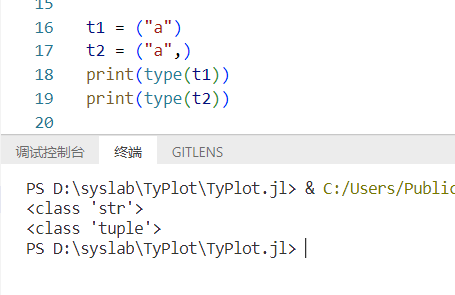

## 15.3元组查询某个元素的下标

mytuple.index(元素)

## 15.4元组查询某个元素的数量

mytuple.count(元素)

## 15.5查询元组数量

len(mytuple)

# 16.VSCode的ctrl+0+k失效、跳转到函数定义失效等

遇到这种情况，可以直接清除缓存

缓存目录如下：

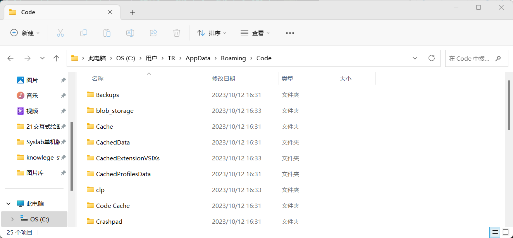

当删除缓存后，所有配置都重置，基本就能解决问题

# 17.lambda函数

匿名函数lambda：是一类无序定义标识符或者说函数名的函数。功能比较简单，只允许包含一个表达式，可以接受任意多个参数，表达式的结果就是函数的返回值

基本语法为：

lambda arg1,arg2,arg3...:<表达式>

例如：

lambda x,y:x * y 输入是x和y，输出是它们的积x * y

lambda:None 没有输入参数，输出是None

**部分Python内置函数接受函数作为参数**,典型的**此类内置函数有**这些:

**filter函数** 此时lambda函数用于指定过滤列表元素的条件。例如filter(lambda x: x % 3 == 0, [1, 2, 3])指定将列表[1,2,3]中能够被3整除的元素过滤出来，其结果是[3]。

**sorted函数** 此时lambda函数用于指定对列表中所有元素进行排序的准则。例如sorted([1, 2, 3, 4, 5, 6, 7, 8, 9], key=lambda x: abs(5-x))将列表[1, 2, 3, 4, 5, 6, 7, 8, 9]按照元素与5距离从小到大进行排序，其结果是[5, 4, 6, 3, 7, 2, 8, 1, 9]。

**map函数** 此时lambda函数用于指定对列表中每一个元素的共同操作。例如map(lambda x: x+1, [1, 2,3])将列表[1, 2, 3]中的元素分别加1，其结果[2, 3, 4]。

**reduce函数** 此时lambda函数用于指定列表中两两相邻元素的结合条件。例如reduce(lambda a, b: '{}, {}'.format(a, b), [1, 2, 3, 4, 5, 6, 7, 8, 9])将列表 [1, 2, 3, 4, 5, 6, 7, 8, 9]中的元素从左往右两两以逗号分隔的字符的形式依次结合起来，其结果是'1, 2, 3, 4, 5, 6, 7, 8, 9'。

以sorted为例，在设置曲线上下层时，有如下用法：

```python
self.layers.sort(key=lambda layer: layer.zorder)
```

上面lambda函数中的layer，默认就是列表中的每一个元素了

# 18.zip函数

`zip` 是 Python 中的一个内置函数，用于将一个或多个可迭代对象合并成一个元组的列表。它的主要作用是将多个可迭代对象的元素一一配对，生成一个元组的列表。

**示例 1：合并两个列表**

```python
pythonCopy codelist1 = [1, 2, 3]
list2 = ['a', 'b', 'c']
result = list(zip(list1, list2))
# 结果：[(1, 'a'), (2, 'b'), (3, 'c')]
```

**示例 2：同时迭代多个列表**

```python
pythonCopy codenames = ['Alice', 'Bob', 'Charlie']
scores = [85, 92, 78]
for name, score in zip(names, scores):
    print(f'{name}: {score} points')
# 输出：
# Alice: 85 points
# Bob: 92 points
# Charlie: 78 points
```

**示例 3：合并字典的键和值**

```python
pythonCopy codemy_dict = {'a': 1, 'b': 2, 'c': 3}
keys, values = zip(*my_dict.items())
# keys 结果：('a', 'b', 'c')
# values 结果：(1, 2, 3)
```

请注意，在示例 3 中，我们使用了 `*` 操作符来拆分字典中的键-值对。

`zip` 的返回值通常需要转换为列表或其他数据结构，以便更轻松地访问和处理。这个函数在许多情况下都很有用，特别是在需要同时迭代多个可迭代对象的情况下。

在syslab中使用到的例子：需求为根据zorder属性对曲线和其对应的图例进行排序，实现曲线层级变化后，对应的图例也要改变

```python
# 根据曲线的 zorder 属性对曲线图例进行排序
sorted_legend_items = sorted(zip(self.handles, self.labels), key=lambda item: item[0].zorder)
# 解压排序后的曲线和标签
self.handles, self.labels = zip(*sorted_legend_items)
# 更新图例
self.legend = self.axes.legend(self.handles, self.labels)
```

# 19.性能测试

可使用time.perf_counter()

官网描述：[time — Time access and conversions — Python 3.12.0 documentation](https://docs.python.org/3/library/time.html#time.perf_counter)

> 返回性能计数器的值（以分数秒为单位），即具有最高可用分辨率的时钟，用于测量短时间间隔。它包括休眠期间经过的时间，是系统范围的。返回值的参考点是未定义的，因此仅两次调用的结果之间的差异有效。

# 20.python版本

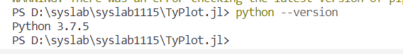

# 21.判断某个关键字参数是否在kwargs里

```python
if 'zorder' in kwargs
```

# 22.随机数

```python
import random
random.random()#获取0-1的随机数
random.random(100)#获取100个0-1之间的随机数
```

# 23.vscode切换python编辑器

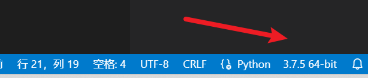

# 24.for i循环

```python
num = ['张三',"李四"]
for i in range(0,len(num)):
	print(num[i])
```

# 25.序列化与反序列化基本代码

序列化

```
import dill
serialized_fig = dill.dumps(cfig)
with open(filename, "wb") as f:
    f.write(serialized_fig)
```

反序列化

```python
class CNotFound():
    def __init__(self) -> None:
        pass

# 重写 dill find_class 函数，处理导入时类不存在的情况
import dill
from io import BytesIO as StringIO
class SyslabUnpickler(dill.Unpickler):
    def find_class(self, module, name):
        try:
            return super(SyslabUnpickler, self).find_class(module, name)
        except (AttributeError, ModuleNotFoundError):
            return CNotFound

def syslab_load(file, ignore=None, **kwds):
    try:
        cfig = SyslabUnpickler(file, ignore=ignore, **kwds).load()
    except Exception as e:
        cfig_current = mw_get_cfig()
        QMessageBox.warning(cfig_current.fig.canvas,"打开文件",f"选择的文件不是有效的数据文件，请选择正确的文件格式进行导入")
        cfig = None
    return cfig

def syslab_loads(str, ignore=True, **kwds):
    file = StringIO(str)
    return syslab_load(file, ignore, **kwds)
```

# 26安装pyqt5 5.15.2

使用pip install -i https://pypi.tuna.tsinghua.edu.cn/simple/ PyQt5==5.15.2安装pyqt5时，遇到下列问题

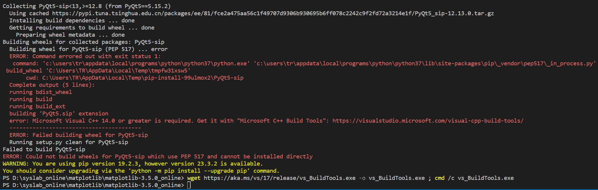

原因是需要用到需要用到 `Microsoft C++ Build Tools`，通过在powershell运行下列代码从微软下载c++生成工具并启动

```powershell
wget https://aka.ms/vs/17/release/vs_BuildTools.exe -o vs_BuildTools.exe ; cmd /c vs_BuildTools.exe
```

安装时，c++/cli选项一段要选择

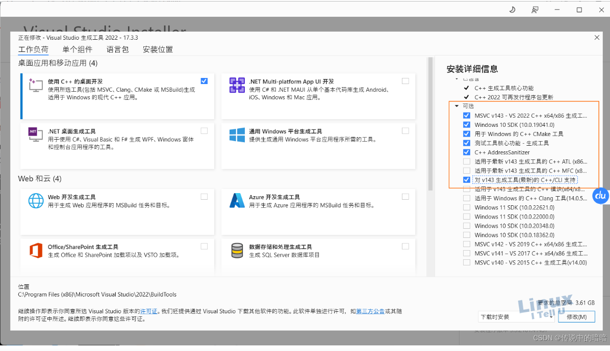

安装成功之后，再次安装pyqt5，安装成功

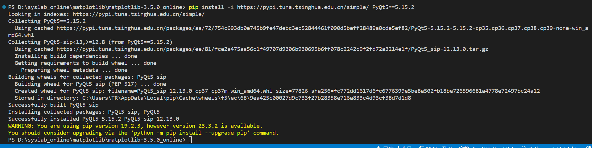

参考链接：[安装Pyqt5报错：ERROR: Failed building wheel for PyQt5-sip-CSDN博客](https://blog.csdn.net/no1xium/article/details/126764041)

# 27.从绝对路径中获取文件名

```python
import os
file_base_name = os.path.basename(filename)
```

# 28.python的字符串与变量拼接f"{}"

```python
import os
file_base_name = os.path.basename(filename)
ax_num = 3
import_num = 4
message = f"{file_base_name} 文件中有{ax_num}个坐标轴，已成功导入{import_num}个坐标轴。\n"
```

# 29.字符串无法和整数、浮点数通过加号进行拼接，但是可以通过字符串格式化实现拼接

```python
# 字符串格式化
# "%s" % 变量
# 字符串 %s 整数 %d 浮点数 %f
str = "字符串"
num = 12
float_num = 3.14
message = "字符串：%s与整数变量：%d与浮点数：%f可以进行拼接"%(str,num,float_num) 
print("message=",message)
```

格式化精度控制方式

```python
# 格式化精度控制
# %m.nf或者%md 其中m是宽度，n是小数点后多少位
message1 = "num的宽度设为5：%4d"%num
print(message1)
message2 = "float的宽度设为5，精度设为1：%5.1f"%float_num
print(message2)
message3 = "格式化表达式，例如：%s"%type(float_num)
print(message3)
```

快速格式化方法

```python
# 快速格式化方法
print(f"快速格式化方法，字符串{str}，整数{num}，浮点数{float_num}")
```

# 30.python判断当前操作系统类型

方法一：目前已用过的方法：os.name。这里只注册了三种值，linux是posix，windows是nt，java虚拟机是java

```python
# 判断操作系统
import os
print("当前操作系统为：",os.name)
```

方法二：sys.platform

```python
# 判断操作系统
import os
import sys
print("当前操作系统为：",os.name)
print("当前操作系统为：",sys.platform)
```

方法三：pplatform.platform()  这个方法有许多扩展，可以获取操作系统的版本号等很多内容

```python
# 判断操作系统
import os
import sys
import platform
print("当前操作系统为：",os.name)
print("当前操作系统为：",sys.platform)
print("当前操作系统为：",platform.platform())
```

[【python】获取当前系统类型os.name-CSDN博客](https://blog.csdn.net/qq_30159015/article/details/82658345)

# 31.获取python的Path对象的字符串格式

```python
# 获取python的Path对象的字符串格式
from pathlib import Path
p = Path("E:\\x\\y.txt")
print("p的类型为",type(p))
print("p的字符串格式",p.__str__())
```

# 32.使用 pip 安装从 Git 仓库克隆下来的库

```powershell
pip install 库路径
```

或者进入到库路径内

```powershell
pip install .
```

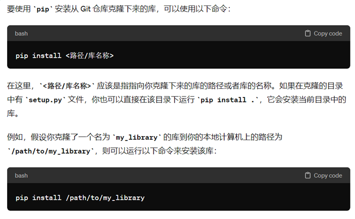

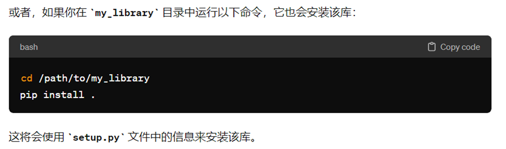

# 33.用切片方式完成序列反转

```python
str1 = "testpeople"
new_str = str1[::-1]
print(new_str)

```

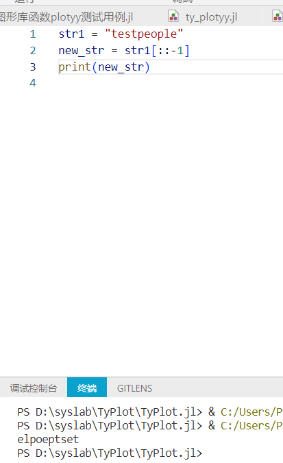

# 34.集合（set）

## 1.创建空集合

set()

```python
# 定义空集合
set1 = set()
print("type(set1)",type(set1))  #set
set2 = {}
print("type(set2)",type(set2))  #dict
```

## 2.取两个集合的差集

set1.difference(set2)

```python
set3 = {1,2,3}
set4 = {3,5,6}
print("差集为:",set3.difference(set4)) #差集为: {1, 2}
print("set3",set3) #set3 {1, 2, 3}
print("set4",set4) #set4 {3, 5, 6}
```

## 3.从一个集合中删除其与另一个集合的交集

set1.difference_update(set2)

```python
# 在集合1中删除集合1与集合2的交集
set3.difference_update(set4)
print("set3",set3) #set3 {1, 2}
print("set4",set4) #set4 {3, 5, 6}
```

## 4.取两个集合的并集

set1.union(set2)

```python
# 取两个集合的并集
set5 = set3.union(set4)
print("set3",set3) #set3 {1, 2, 3}
print("set4",set4) #set4 {3, 5, 6}
print("set5",set5) #set5 {1, 2, 3, 5, 6}
```

# 35字典

## 1.字典删除

dict.pop(key)

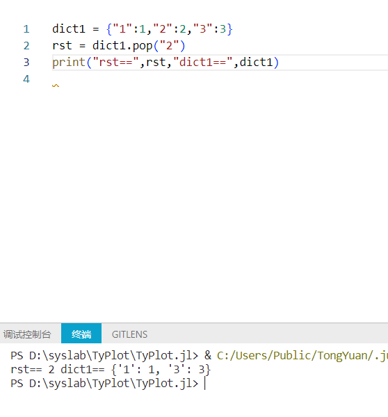

# 36文件处理

## 1.追加写入文件

以“a”模式

```python
k = 10
while k > 0:
    k -= 1
    with open("myfile.txt",'a') as f:
        f.write("hello world\n")

```

### 进一步解读：

#### 1.with的作用

with是python中的一个关键字，用于管理上下文协议，可以确保诸如文件或网络连接这样的资源在使用完毕后可以正确地被关闭或清理，无论在处理资源时是否发生错误。

#### 2.as f的作用

as f是将open("myfile.txt",'a')返回的文件对象赋值给变量f

#### 3.open函数中的其他模式

- “r”  只读模式，如果文件不存在，则会报错。这是默认模式
- "w" 写入模式，如果文件存在，会被覆盖。如果文件不存在，会创建新文件
- "x" 创建模式，如果文件已存在，会报错
- "b" 二进制模式，可以与其他模式结合使用，如rb wb ab用于读取、写入、追加二进制文件
- "t" 文本模式，可以与其他模式结合使用，如rt wt at用于读取、写入、追加文本文件

# 37获取当前时间是几时几分几秒

```python
from datetime import datetime

# 获取当前时间
now = datetime.now()

# 打印当前时间的小时，分钟和秒
print("当前时间是：{}时{}分{}秒".format(now.hour, now.minute, now.second))
```

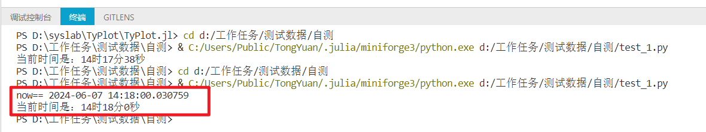

# 38 a/b和a//b的区别

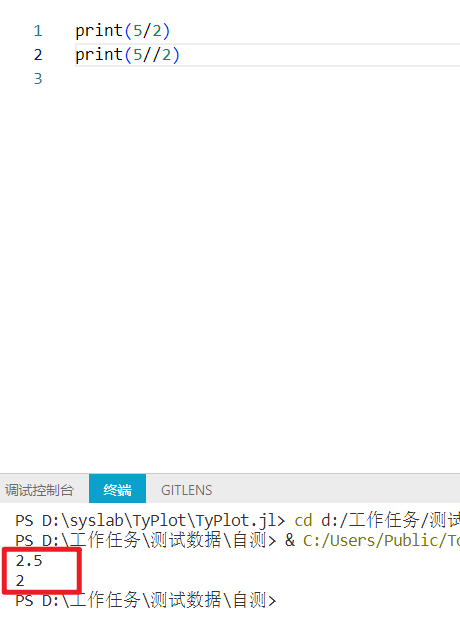

# 39 python如何导入txt文件内的数据

在Python中，我们可以使用内置的`open()`函数或者`pandas`库的`read_csv()`函数来导入txt文件的数据。

下面是一个使用`open()`函数的例子：

```python
# 打开文件
with open('data.txt', 'r') as file:
    # 读取文件的所有内容
    data = file.read()

print(data)
```

这段代码会打开名为"data.txt"的文件，然后读取它的所有内容，并存储在变量`data`中。

如果你的txt文件是一个表格数据，比如数据之间用逗号或者制表符分隔，那么你可以使用`pandas`库的`read_csv()`函数来导入数据，这个函数可以将数据导入为一个DataFrame对象，这样就可以方便地进行数据分析。以下是一个例子：

```python
import pandas as pd

# 读取txt文件的数据
df = pd.read_csv('data.txt', sep='\t')

print(df)
```

这段代码会读取名为"data.txt"的文件，假设数据之间是用制表符('\t')分隔的，然后将数据导入为一个DataFrame对象。

注意，你需要先安装pandas库，安装命令是`pip install pandas`。

# 40 python求解标准差、平方根

在 Python 中，你可以使用 sqrt 函数来计算平方根，使用 std 函数来计算标准差。这些函数都可以在 NumPy 或者 math 模块中找到

在Python中，我们可以使用内置的math库和numpy库来求解标准差和平方根。

1. 求解标准差：可以使用numpy的std()函数。以下是一个例子：

```python
import numpy as np

# 创建一个数据列表
data = [1, 2, 3, 4, 5]

# 计算标准差
std_dev = np.std(data)

print("标准差是：", std_dev)
```

1. 求解平方根：可以使用math的sqrt()函数。以下是一个例子：

```python
import math

# 定义一个数
num = 9

# 计算平方根
sqrt_num = math.sqrt(num)

print("平方根是：", sqrt_num)
```

这个代码会计算数字9的平方根。注意，math.sqrt()只接受非负数作为输入。如果你尝试输入负数，它会抛出一个错误。

# 41 python的“@property”和"@<属性名>.setter"

在Python中，`@property`是一个内置的装饰器，主要用于将一个方法转换为属性，使其可以像访问属性那样访问该方法。

一般情况下，我们可以通过`@property`装饰器将一个`getter`方法转换为同名属性，然后可以通过`@<属性名>.setter`装饰器来定义对应的`setter`方法。这样，我们就可以像访问属性那样来获取和修改数据，而不需要像调用方法那样加上括号。

以下是一个例子：

```python
class Person:
    def __init__(self, name):
        self._name = name

    @property
    def name(self):
        return self._name

    @name.setter
    def name(self, value):
        self._name = value

p = Person('Tom')
print(p.name)  # 输出: Tom
p.name = 'Jerry'
print(p.name)  # 输出: Jerry
```

在这个例子中，`name`是一个属性，我们可以通过`p.name`来获取它的值，也可以通过`p.name = 'Jerry'`来修改它的值。实际上，当我们访问`p.name`时，Python会调用`Person`类的`name`方法来获取`_name`的值，当我们修改`p.name`时，Python会调用`Person`类的`name`方法来修改`_name`的值。

总的来说，`@property`装饰器可以帮助我们更好地封装数据，使我们的代码更加简洁，易于理解和维护。

# 42 python如何实现四舍五入

在Python中，我们可以使用内置的`round()`函数来实现四舍五入。以下是一个例子：

```python
# 定义一个浮点数
num = 3.14159

# 对num进行四舍五入，保留2位小数
rounded_num = round(num, 2)

print("四舍五入后的结果是：", rounded_num)
```

这段代码会输出"四舍五入后的结果是：3.14。

`round()`函数接受两个参数：第一个参数是需要进行四舍五入的数，第二个参数是小数点后需要保留的位数。如果省略第二个参数，`round()`函数会返回最接近输入值的整数。

# 43 python如何修改数组形状，例如从(500,1)修改为(500,)

在Python中，我们可以使用numpy库的reshape()函数来修改数组的形状。

以下是一个例子：

```python
import numpy as np

# 创建一个形状为(500, 1)的数组
arr = np.zeros((500, 1))

print("修改前的形状：", arr.shape)

# 使用reshape()函数修改数组的形状
arr = arr.reshape(500)

print("修改后的形状：", arr.shape)
```

这段代码首先创建了一个形状为(500, 1)的数组，然后使用reshape()函数将其形状修改为(500,)。

另外，你也可以使用numpy的ravel()或flatten()函数来将多维数组转换为一维数组。例如：

```python
arr = arr.ravel()  # 或者 arr = arr.flatten()
```

这两个方法都可以达到同样的效果，将多维数组降为一维。