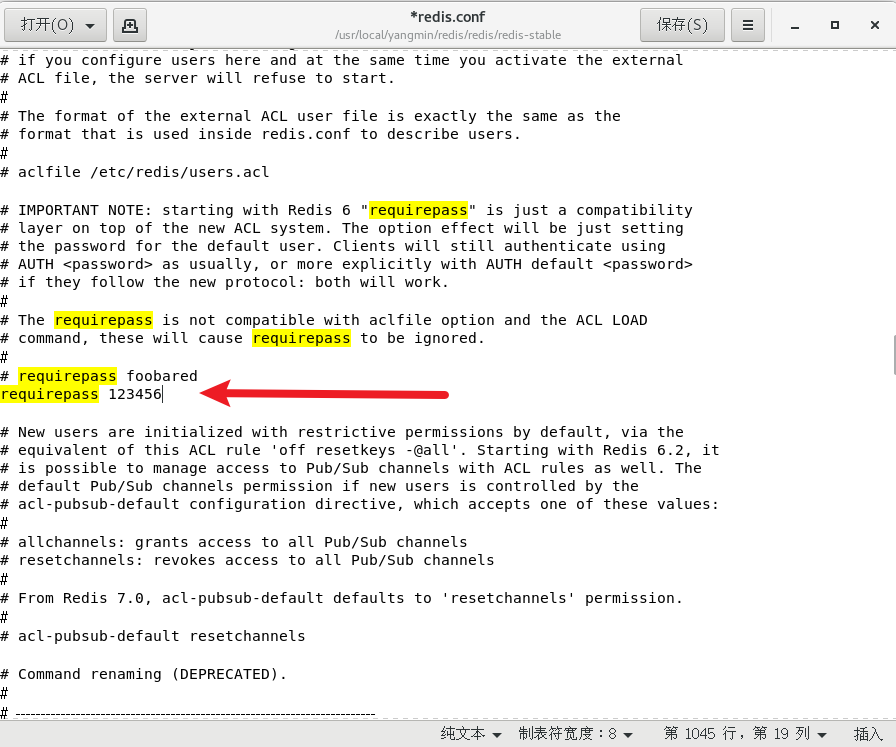

# redis拾遗

# 1.CentOS安装redis

## 1.下载redis

使用命令下载时遇到了此问题：


转换方式，在centos里的http://download.redis.io网站直接下载


## 2.解压

```powershell
xzvf redis-stable.tar.gz 
```

tar命令主要参数解释：
-z参数：表示要解压或压缩的是tar.gz文件（如果是tar.bz2就是-j）
-x参数：表示是执行解压缩操作而不是打包操作
-v参数：表示列出解压时的详细消息
-f参数：指定要解压的文件名，或者指定新建的打包文件的名字
tar命令解压时还可以指定解压的目标目录，也就是把压缩文件的内容解压到哪个文件夹内，这个参数是-C（大写的C），例子：
解压tar.gz文件：tar -zxv -f test.tar.gz -C /home/user/target
解压tar.bz2文件： tar -jxv -f test.tar.bz2 -C /home/user/target


## 3.编译

```powershell
make
```


编译成功：


## 4.修改配置文件


设置后台启动，守护线程


修改IP


添加密码



## 5.启动服务

在src文件夹下，运行redis-server命令


运行成功：


## 6.启动客户端


验证连接正确


# 2.redis切换数据库

redis默认有16个数据库，编号从0-15

切换命令为select index


# 3.redis支持的数据类型


五种形式：字符串、哈希表、链表、集合、有序集合

键(key)都是字符串

# 4.redis字符串设置值、获取值

## 设置值

```powershell
set key value
```


## 获取值

```powershell
get key
```


# 5.设置过期

```powershell
setex key seconds value
```

- setex:  可以理解为set expire expire是过期的意思
- seconds: 时间，单位是秒

```powershell
ttl key
```

- 查看当前key还剩多少秒过期


- 如果ttl查看剩余时间为-2，说明已经过期。不设置过期的数据，默认ttl的时间是-1

# 6.查看所有keys

```powershell
keys pattern
```


# 7.批量设置、批量获取

```powershell
mset key value key value
mget key key
```


# 8.key相关指令

可参考链接为：
[Redis 命令参考 — Redis 命令参考 (redisfans.com)](http://doc.redisfans.com/)

常用指令包括

## 删除

del


## 是否存在

exists


# 9.哈希相关指令

哈希指令都是h开头，hash的意思

## 设置值

hset key field value


## 获取值

hget key field value

hkeys key

hvals  key


## 删除值

hdel key field


## 更新值

hset key field newvalue


# 10.链表相关指令

## 设置值

从左边添加

lpush ket value


从右边添加

rpush kety value


## 删除值

lrem key count val

count = 0,移除链表中所有与val相等的值

count > 0,从链表左侧移除count个与val相等的值

count < 0,从链表右侧移除count个与val相等的值


## 获取值

lrange key start stop


## 更新值

lset key index val


# 11.集合相关指令

## 设置值

sadd key val


## 获取值

smembers key 


## 删除值

srem key val


# 12.有序集合相关指令

## 设置值

有序集合的有序，是通过一个score实现的

zadd key score val

## 获取值

zrange key start end

## 删除值

zrem key member


