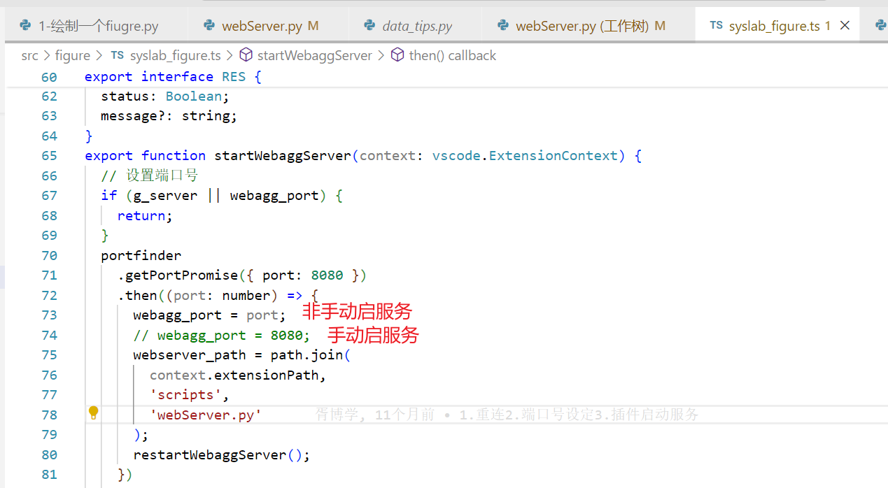
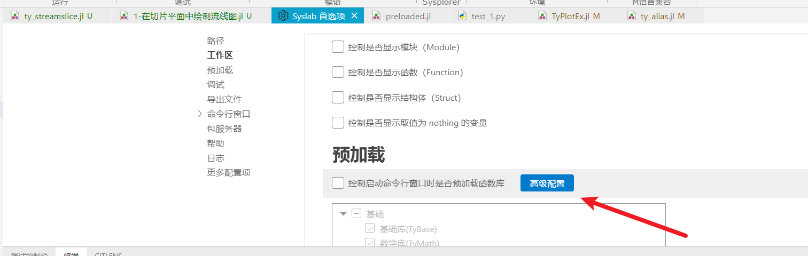

# syslab拾遗

# 1.打包whl文件步骤

- 以打包matplotlib库为例，拉取最新的matplotlib代码

- 在linux环境的syslab中打开该库代码

- 在终端输入下列命令即可

  ```powershell
  python setup.py bdist_wheel
  ```

- 随后可以在matplotlib的dist文件夹内找到打包好的.whl文件


# 2.安装whl文件步骤

- 以matplotlib库为例，已有其whl文件

- 到syslab的python.exe文件夹下，一般是~/.julia/miniforge3/bin

- 首先卸载已有的matplotlib库

- 安装.whl文件


# 3.在linux的syslab online设置环境变量

可修改syslab-hw-environment-centos.js文件

文件路径：

安装路径/syslab-server/out/node


# 4.add 库时修改代理服务器命令

有时add库时，需要修改服务器，这样就可以有权限下载，或者下载更快。例如在linux的syslab online环境add 库时就有可能会需要该命令：

```powershell
ENV["JULIA_PKG_SERVER"]="https://releases-dev.tongyuan.cc/stream-dev"
```

# 5.syslab读取文件内数据

## 5.1txt文件

```julia
importdata("data.txt","-ascii")
```

# 6.破解syslab的license

找到安装目录下的product.json这个文件，例如D:\software\syslab\syslab2024\syslab0222\Syslab 2024a\Bin\resources\app\product.json

然后将hasLicense变量改为false即可


# 7.syslab online更新插件步骤

- 将插件上传到服务器

- 从VSIX安装，例如：


# 8.syslab 配置centos版本的syslab

## 1.下载

下载链接：[syslab / syslab · GitLab (tongyuan.cc)](https://git.tongyuan.cc/syslab/syslab)

​	

下载如图所示两处均可，其中CentOS7.9集群版更新，不过需要预编译，安装时间久

## 2.使用winscp传到linux系统中

## 3.卸载已有syslab


或者直接覆盖安装

## 4.安装syslab

```powershell
chmod +x XXX.run
sudo ./XXX.run -p 安装路径
```


# 9.Syslab Online打包插件

需要安装node.js、yarn等，并使用下列命令


使用下列命令打插件

```bash
vsce package
```

期间会有两次判断是或否的步骤，均选是即可


> `vsce package`是一个用于打包Visual Studio Code插件的命令。它由`vsce`命令行工具提供，可以将你的扩展打包成VSIX格式的安装包。
>
> 当你运行`vsce package`命令时，vsce将会把当前目录下的所有文件都打包进一个文件夹里，并且将这个文件夹进行zip压缩，生成一个名为`<extension>-<version>.vsix`的文件。这个文件就是你的VS Code扩展的安装包，可以直接双击进行安装。

在vsce命令完成之后，在左侧可以看到打的插件


# 10.插件手动启服务与自动启服务

在代码里修改下列代码即可实现打出的插件支持手动启服务或者自动启服务



# 11.设置随机数种子

```julia
using TyMath
rng = mt19937ar(1234);
r1 = rand(rng,3,4)
rng = mt19937ar(1234);
r2 = rand(rng,3,4)
```


# 12.syslab格式化julia代码

```julia
using JuliaFormatter; 
format(pwd(), BlueStyle())
```


# 13.syslab在xlabel中添加希腊字母

字符串前面加raw，同时用$包裹希腊字母

```julia
title(raw"测试希腊字母$\beta$")
```


# 14.Syslab开发者模式设置

## 图形库

```julia
ENV["TY_RELEASE_MODE"] = false
```

第一种方式为在syslab首选项内设置   只在syslab生效




第二种方式为设置环境变量  全局生效


验证是否设置成功


打印开发模式这句话，即为设置成功

变量未设置情况


## 图形扩展库

```julia
ENV["TY_RELEASE_MODE_PLOTEX"] = "false"
```

