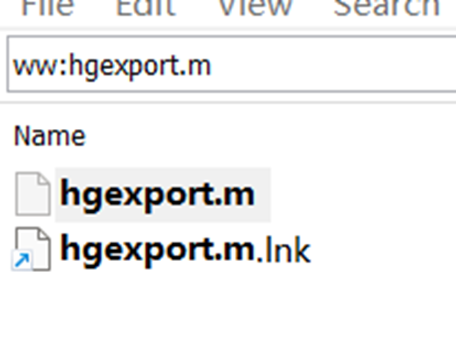

# 快捷键拾遗

# 1.vscode syslab

## 展开所有折叠 ctrl+k+j

## 打开波浪线提示   [vscode 没有代码智能提示和错误波浪线_vscode 写sass没有智能提示-CSDN博客](https://blog.csdn.net/jUst3Doit/article/details/112368269)

## 格式化代码 shift+alt+F

# 2.everything

## 全字匹配   

使用ww:搜索内容的方式

参考链接：https://zhuanlan.zhihu.com/p/81861555

